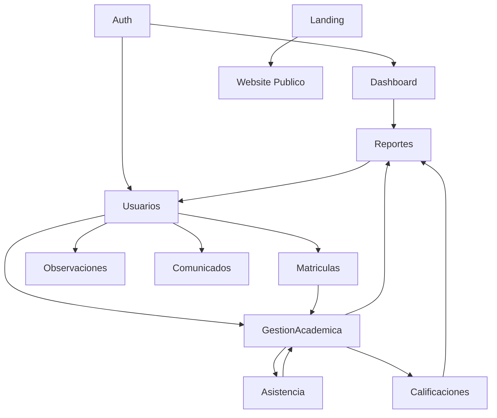
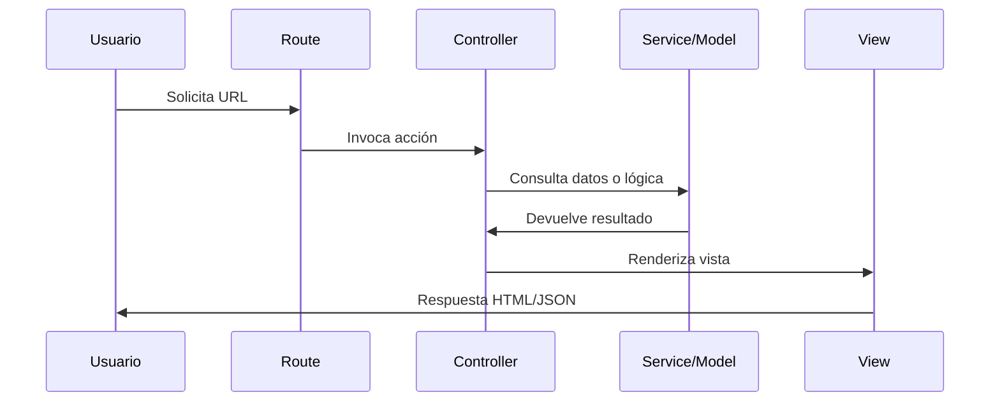
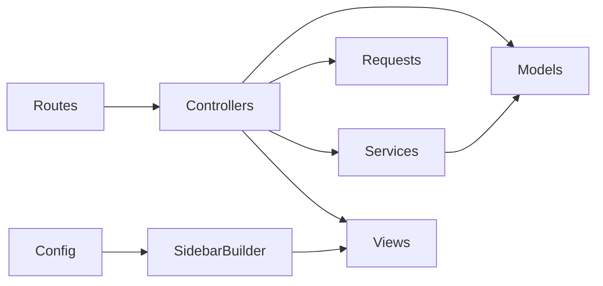
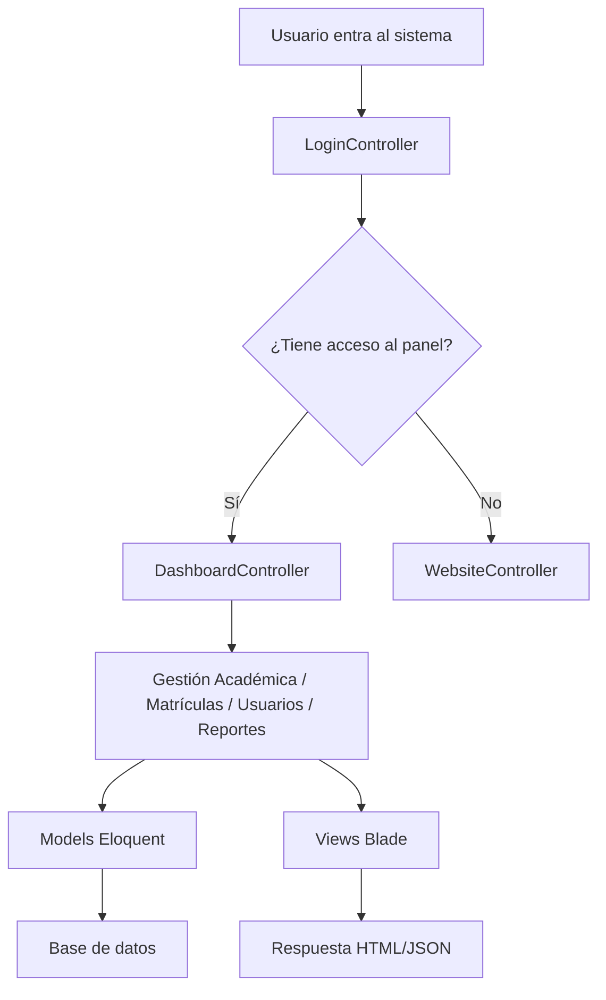
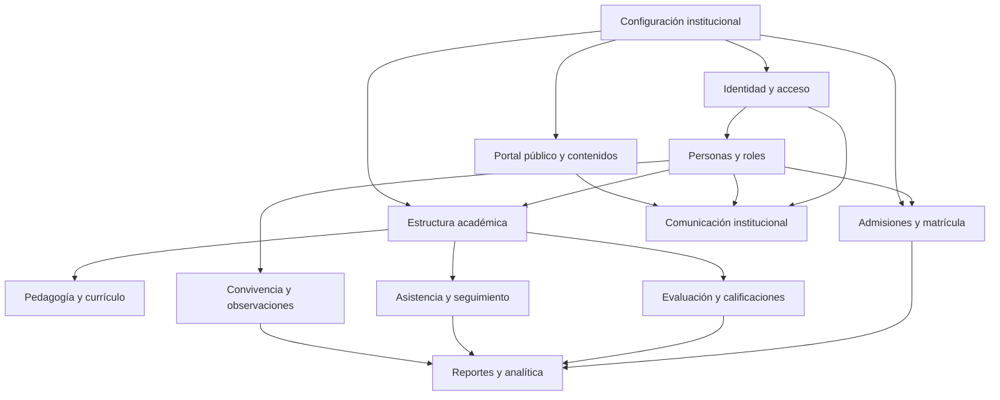
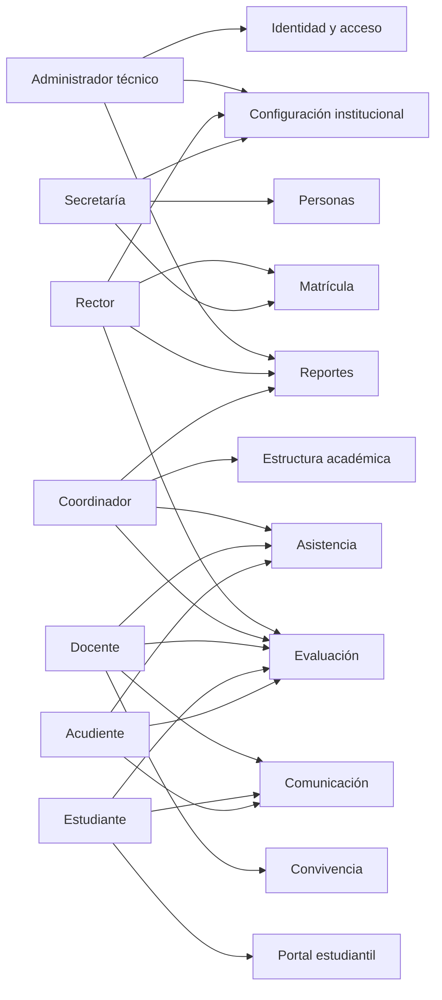

# Arquitectura del Sistema Colegio

## 1. Resumen ejecutivo

Este proyecto corresponde a un sistema escolar en transición hacia una arquitectura Laravel 12 modular, con un componente legado aún presente en la estructura general del repositorio. La aplicación activa está contenida en la carpeta [laravel](laravel), mientras que el repositorio raíz también conserva un sistema legacy en proceso de migración.

El diseño actual muestra una arquitectura orientada a módulos funcionales, con separación por dominio bajo [laravel/app/Modules](laravel/app/Modules), rutas agrupadas en [laravel/routes/web.php](laravel/routes/web.php), vistas Blade en [laravel/resources/views](laravel/resources/views), y un sistema de autenticación/autorización basado en middleware y roles.

## 2. Árbol completo de directorios del proyecto

```text
colegio/
├── .git/
├── .htaccess
├── auditorias/
├── docs/
├── estructura.txt
├── index.php
├── laravel/
│   ├── .editorconfig
│   ├── .env
│   ├── .env.example
│   ├── .gitattributes
│   ├── .gitignore
│   ├── .phpunit.result.cache
│   ├── app/
│   │   ├── Core/
│   │   │   └── Http/
│   │   │       └── Controllers/
│   │   ├── Modules/
│   │   │   ├── Asistencia/
│   │   │   │   ├── Controllers/
│   │   │   │   └── Models/
│   │   │   ├── Auth/
│   │   │   │   ├── Controllers/
│   │   │   │   ├── Mail/
│   │   │   │   ├── Models/
│   │   │   │   ├── Requests/
│   │   │   │   └── ...
│   │   │   ├── Calificaciones/
│   │   │   │   ├── Controllers/
│   │   │   │   ├── Models/
│   │   │   │   └── Requests/
│   │   │   ├── Comunicados/
│   │   │   │   ├── Controllers/
│   │   │   │   ├── Models/
│   │   │   │   └── Requests/
│   │   │   ├── Dashboard/
│   │   │   │   └── Controllers/
│   │   │   ├── GestionAcademica/
│   │   │   │   ├── Controllers/
│   │   │   │   ├── Models/
│   │   │   │   └── Requests/
│   │   │   ├── Landing/
│   │   │   │   ├── Controllers/
│   │   │   │   ├── Models/
│   │   │   │   └── Requests/
│   │   │   ├── Matriculas/
│   │   │   │   ├── Controllers/
│   │   │   │   ├── Models/
│   │   │   │   └── ...
│   │   │   ├── Observaciones/
│   │   │   │   ├── Controllers/
│   │   │   │   ├── Models/
│   │   │   │   └── Requests/
│   │   │   ├── Perfil/
│   │   │   │   └── Controllers/
│   │   │   ├── Rector/
│   │   │   │   └── Controllers/
│   │   │   ├── Reportes/
│   │   │   │   ├── Controllers/
│   │   │   │   ├── Models/
│   │   │   │   └── ...
│   │   │   └── Usuarios/
│   │   │       ├── Controllers/
│   │   │       ├── Models/
│   │   │       ├── Requests/
│   │   │       └── Services/
│   │   ├── Providers/
│   │   └── Shared/
│   ├── bootstrap/
│   ├── config/
│   ├── database/
│   │   ├── migrations/
│   │   └── seeders/
│   ├── public/
│   ├── resources/
│   │   ├── css/
│   │   ├── js/
│   │   └── views/
│   ├── routes/
│   ├── storage/
│   ├── tests/
│   ├── vendor/
│   ├── artisan
│   ├── composer.json
│   ├── package.json
│   ├── phpunit.xml
│   ├── vite.config.js
│   └── README.md
├── scripts/
└── README.md
```

## 3. Mapa de módulos funcionales

### Módulos principales

- Auth: autenticación, login, recuperación de contraseña.
- Dashboard: panel inicial y KPIs.
- Usuarios: estudiantes, docentes, administrativos, listados y registro.
- GestionAcademica: materias, cursos, asignaciones, horarios.
- Matriculas: matrícula de estudiantes.
- Calificaciones: periodos, tipos de actividad, actividades y notas.
- Observaciones: registro y gestión de observaciones.
- Reportes: boletines y estadísticas.
- Asistencia: control de asistencia por asignación.
- Comunicados: gestión de notificaciones/comunicados.
- Landing: contenido público y galería/noticias del sitio web.
- Perfil: perfil de usuario autenticado.
- Rector: controlador de asistencia especializado para el panel del rector.

## 4. Diagrama de dependencias entre módulos



## 5. Flujo MVC general



### Ejemplo real

- Ruta: [laravel/routes/web.php](laravel/routes/web.php)
- Controlador: [laravel/app/Modules/Usuarios/Controllers/Registro/RegistroEstudiantesController.php](laravel/app/Modules/Usuarios/Controllers/Registro/RegistroEstudiantesController.php)
- Servicio: [laravel/app/Modules/Usuarios/Services/EstudianteRegistroService.php](laravel/app/Modules/Usuarios/Services/EstudianteRegistroService.php)
- Modelo: [laravel/app/Modules/Usuarios/Models/Estudiante.php](laravel/app/Modules/Usuarios/Models/Estudiante.php)
- Vista: [laravel/resources/views/Rector/usuarios/registro/estudiantes.blade.php](laravel/resources/views/Rector/usuarios/registro/estudiantes.blade.php)

## 6. Inventario de Controllers y responsabilidades

| Controller | Módulo | Responsabilidad |
|---|---|---|
| [laravel/app/Modules/Auth/Controllers/LoginController.php](laravel/app/Modules/Auth/Controllers/LoginController.php) | Auth | Login, redirección según rol y cierre de sesión |
| [laravel/app/Modules/Auth/Controllers/PasswordResetController.php](laravel/app/Modules/Auth/Controllers/PasswordResetController.php) | Auth | Recuperación de contraseña |
| [laravel/app/Modules/Dashboard/Controllers/DashboardController.php](laravel/app/Modules/Dashboard/Controllers/DashboardController.php) | Dashboard | KPIs, resúmenes y listas del panel |
| [laravel/app/Modules/Usuarios/Controllers/ListadosController.php](laravel/app/Modules/Usuarios/Controllers/ListadosController.php) | Usuarios | Listados y activación/desactivación de usuarios |
| [laravel/app/Modules/Usuarios/Controllers/Registro/RegistroEstudiantesController.php](laravel/app/Modules/Usuarios/Controllers/Registro/RegistroEstudiantesController.php) | Usuarios | Registro y edición de estudiantes |
| [laravel/app/Modules/Usuarios/Controllers/Registro/RegistroDocentesController.php](laravel/app/Modules/Usuarios/Controllers/Registro/RegistroDocentesController.php) | Usuarios | Registro y edición de docentes |
| [laravel/app/Modules/Usuarios/Controllers/Registro/RegistroAdministrativosController.php](laravel/app/Modules/Usuarios/Controllers/Registro/RegistroAdministrativosController.php) | Usuarios | Registro y edición de administrativos |
| [laravel/app/Modules/Matriculas/Controllers/MatriculasController.php](laravel/app/Modules/Matriculas/Controllers/MatriculasController.php) | Matrículas | Gestión de matrículas |
| [laravel/app/Modules/GestionAcademica/Controllers/GestionAcademicaController.php](laravel/app/Modules/GestionAcademica/Controllers/GestionAcademicaController.php) | Gestión Académica | Materias, cursos, asignaciones y horarios |
| [laravel/app/Modules/Calificaciones/Controllers/CalificacionesController.php](laravel/app/Modules/Calificaciones/Controllers/CalificacionesController.php) | Calificaciones | Periodos, actividades, tipos de actividad y notas |
| [laravel/app/Modules/Observaciones/Controllers/ObservacionesController.php](laravel/app/Modules/Observaciones/Controllers/ObservacionesController.php) | Observaciones | Gestión de observaciones |
| [laravel/app/Modules/Reportes/Controllers/BoletinesController.php](laravel/app/Modules/Reportes/Controllers/BoletinesController.php) | Reportes | Generación, visualización y estado de boletines |
| [laravel/app/Modules/Reportes/Controllers/EstadisticasController.php](laravel/app/Modules/Reportes/Controllers/EstadisticasController.php) | Reportes | Estadísticas del sistema |
| [laravel/app/Modules/Comunicados/Controllers/ComunicadosController.php](laravel/app/Modules/Comunicados/Controllers/ComunicadosController.php) | Comunicados | Gestión de comunicados |
| [laravel/app/Modules/Landing/Controllers/EditarLandingController.php](laravel/app/Modules/Landing/Controllers/EditarLandingController.php) | Landing | Administración del contenido público |
| [laravel/app/Modules/Landing/Controllers/WebsiteController.php](laravel/app/Modules/Landing/Controllers/WebsiteController.php) | Landing | Inicio público del sitio |
| [laravel/app/Modules/Perfil/Controllers/PerfilController.php](laravel/app/Modules/Perfil/Controllers/PerfilController.php) | Perfil | Perfil y contraseña de usuario |
| [laravel/app/Modules/Rector/Controllers/AsistenciaController.php](laravel/app/Modules/Rector/Controllers/AsistenciaController.php) | Rector | Asistencia y historial por asignación |

## 7. Inventario de Models y relaciones Eloquent

### Modelos principales

| Modelo | Tabla | Relaciones principales |
|---|---|---|
| [laravel/app/Modules/Auth/Models/Usuario.php](laravel/app/Modules/Auth/Models/Usuario.php) | usuarios | belongsTo Rol |
| [laravel/app/Modules/Auth/Models/Rol.php](laravel/app/Modules/Auth/Models/Rol.php) | roles | hasMany Usuario |
| [laravel/app/Modules/Usuarios/Models/Estudiante.php](laravel/app/Modules/Usuarios/Models/Estudiante.php) | estudiantes | belongsTo Usuario, hasMany Matricula, hasMany Boletin, hasMany Asistencia |
| [laravel/app/Modules/Usuarios/Models/Profesor.php](laravel/app/Modules/Usuarios/Models/Profesor.php) | profesores | belongsTo Usuario, hasMany AsignacionAcademica |
| [laravel/app/Modules/Usuarios/Models/Acudiente.php](laravel/app/Modules/Usuarios/Models/Acudiente.php) | acudientes | relación con estudiantes |
| [laravel/app/Modules/Matriculas/Models/Matricula.php](laravel/app/Modules/Matriculas/Models/Matricula.php) | matriculas | belongsTo Estudiante, belongsTo Curso |
| [laravel/app/Modules/GestionAcademica/Models/Curso.php](laravel/app/Modules/GestionAcademica/Models/Curso.php) | cursos | hasMany Matricula, hasMany AsignacionAcademica, belongsTo Profesor |
| [laravel/app/Modules/GestionAcademica/Models/Materia.php](laravel/app/Modules/GestionAcademica/Models/Materia.php) | materias | sin relaciones explícitas en este archivo |
| [laravel/app/Modules/GestionAcademica/Models/AsignacionAcademica.php](laravel/app/Modules/GestionAcademica/Models/AsignacionAcademica.php) | asignaciones_academicas | belongsTo Profesor, belongsTo Materia, belongsTo Curso, hasMany Actividad |
| [laravel/app/Modules/GestionAcademica/Models/Horario.php](laravel/app/Modules/GestionAcademica/Models/Horario.php) | horarios | belongsTo AsignacionAcademica |
| [laravel/app/Modules/Calificaciones/Models/Actividad.php](laravel/app/Modules/Calificaciones/Models/Actividad.php) | actividades | belongsTo AsignacionAcademica, belongsTo Periodo, belongsTo TipoActividad, hasMany Nota |
| [laravel/app/Modules/Calificaciones/Models/Nota.php](laravel/app/Modules/Calificaciones/Models/Nota.php) | notas | belongsTo Actividad, belongsTo Estudiante |
| [laravel/app/Modules/Calificaciones/Models/Periodo.php](laravel/app/Modules/Calificaciones/Models/Periodo.php) | periodos_academicos | hasMany Actividad |
| [laravel/app/Modules/Calificaciones/Models/TipoActividad.php](laravel/app/Modules/Calificaciones/Models/TipoActividad.php) | tipos_actividad | hasMany Actividad |
| [laravel/app/Modules/Asistencia/Models/Asistencia.php](laravel/app/Modules/Asistencia/Models/Asistencia.php) | asistencia | belongsTo Estudiante, belongsTo AsignacionAcademica |
| [laravel/app/Modules/Observaciones/Models/Observacion.php](laravel/app/Modules/Observaciones/Models/Observacion.php) | observaciones | belongsTo Usuario/Estudiante según implementación |
| [laravel/app/Modules/Reportes/Models/Boletin.php](laravel/app/Modules/Reportes/Models/Boletin.php) | boletines | belongsTo Estudiante, belongsTo Periodo, hasMany BoletinDetalle |
| [laravel/app/Modules/Reportes/Models/BoletinDetalle.php](laravel/app/Modules/Reportes/Models/BoletinDetalle.php) | boletin_detalle | belongsTo Boletin, belongsTo AsignacionAcademica |
| [laravel/app/Modules/Comunicados/Models/Notificacion.php](laravel/app/Modules/Comunicados/Models/Notificacion.php) | notificaciones | relación con usuarios o grupos |
| [laravel/app/Modules/Landing/Models/LandingContenido.php](laravel/app/Modules/Landing/Models/LandingContenido.php) | landing_contenido | sin relaciones |
| [laravel/app/Modules/Landing/Models/LandingGaleria.php](laravel/app/Modules/Landing/Models/LandingGaleria.php) | landing_galeria | sin relaciones |
| [laravel/app/Modules/Landing/Models/LandingNoticia.php](laravel/app/Modules/Landing/Models/LandingNoticia.php) | landing_noticias | sin relaciones |

## 8. Inventario de rutas agrupadas por módulo

### Autenticación
- GET /login
- POST /login
- POST /forgot-password
- GET /reset-password
- POST /reset-password
- POST /logout

### Panel administrativo
- GET /inicio
- GET /listados
- POST /listados/...
- GET /matriculas
- POST /matriculas/...
- GET /gestion-academica
- GET /gestion-academica/cursos/{curso}
- POST /gestion-academica/...
- GET /registro/...
- GET /calificaciones
- GET /calificaciones/asignaciones/{asignacion}
- GET /calificaciones/actividades/{actividad}/notas
- GET /observaciones
- GET /boletines
- GET /boletines/{boletin}
- GET /asistencia/asignaciones/{asignacion}
- GET /estadisticas
- GET /comunicados
- GET /editar-landing
- GET /perfil

### Público
- GET /

## 9. Middleware y sistema de autenticación/autorización

### Middleware de autorización
- [laravel/app/Core/Http/Middleware/EnsureRole.php](laravel/app/Core/Http/Middleware/EnsureRole.php): valida sesión y rol del usuario.
- Registrado en [laravel/bootstrap/app.php](laravel/bootstrap/app.php) con el alias `role`.

### Reglas actuales
- El panel administrativo está protegido con `auth` y `role:admin,rector`.
- El perfil usa `auth` sin restricción adicional.
- El login público usa `guest`.

### Modelo de autenticación
- [laravel/app/Modules/Auth/Models/Usuario.php](laravel/app/Modules/Auth/Models/Usuario.php) extiende `Authenticatable`.
- Usa `estado_usuario` para determinar si la cuenta está activa.
- Expone helpers como `tienePanelAdmin()` y `estaActivo()`.

## 10. Organización de views y componentes

### Estructura de vistas

```text
resources/views/
├── auth/
├── emails/
├── layouts/
├── Rector/
│   ├── asistencia/
│   ├── calificaciones/
│   ├── comunicados/
│   ├── dashboard/
│   ├── gestion-academica/
│   ├── landing/
│   ├── matriculas/
│   ├── observaciones/
│   ├── perfil/
│   ├── reportes/
│   └── usuarios/
└── website/
```

### Componentes relevantes
- [laravel/app/Shared/SidebarBuilder.php](laravel/app/Shared/SidebarBuilder.php): construye el menú lateral a partir de la configuración [laravel/config/panel_menu.php](laravel/config/panel_menu.php).
- [laravel/config/panel_menu.php](laravel/config/panel_menu.php): fuente de verdad de la navegación del panel.

## 11. Estructura de Base de Datos (migraciones)

### Migraciones presentes
- [laravel/database/migrations/0001_01_01_000000_create_users_table.php](laravel/database/migrations/0001_01_01_000000_create_users_table.php)
- [laravel/database/migrations/0001_01_01_000001_create_cache_table.php](laravel/database/migrations/0001_01_01_000001_create_cache_table.php)
- [laravel/database/migrations/0001_01_01_000002_create_jobs_table.php](laravel/database/migrations/0001_01_01_000002_create_jobs_table.php)
- [laravel/database/migrations/2026_07_12_142935_drop_default_scaffold_tables.php](laravel/database/migrations/2026_07_12_142935_drop_default_scaffold_tables.php)
- [laravel/database/migrations/2026_07_18_150023_create_landing_contenido_table.php](laravel/database/migrations/2026_07_18_150023_create_landing_contenido_table.php)
- [laravel/database/migrations/2026_07_18_150024_create_landing_galeria_table.php](laravel/database/migrations/2026_07_18_150024_create_landing_galeria_table.php)
- [laravel/database/migrations/2026_07_18_150024_create_landing_noticias_table.php](laravel/database/migrations/2026_07_18_150024_create_landing_noticias_table.php)

### Observación importante
La mayoría de las tablas de negocio que el sistema usa (usuarios, estudiantes, profesores, cursos, materias, matriculas, asignaciones, notas, boletines, asistencia, observaciones, etc.) no aparecen como migraciones propias del proyecto. Esto indica que el sistema está operando sobre una base de datos heredada del sistema legacy.

## 12. Dependencias entre carpetas



## 13. Detección de duplicidad de código

Se observan patrones repetidos en varias áreas:

- Repetición de operaciones de activar/desactivar en múltiples controladores.
- Repetición de lógica de validación/duplicados en controladores CRUD.
- Repetición de código de generación de códigos únicos entre servicios y modelos heredados.
- Repetición de lógica de creación de usuarios para estudiantes y docentes.

## 14. Módulos huérfanos o sin uso

No se detecta un módulo completamente huérfano, pero sí hay áreas que parecen ser menos consolidadas o parcialmente incompletas:

- El módulo Rector está presente, pero su rol funcional es aún muy dependiente del panel administrativo general.
- El módulo Comunicados existe, aunque su integración con el menú muestra una entrada de Notificaciones que no aparece claramente como ruta activa en el router actual.
- El módulo Perfil está presente, pero no se observa un fuerte vínculo con la arquitectura general de permisos.

## 15. Diagrama del flujo general del sistema



## 16. Problemas arquitectónicos encontrados

1. Falta de migraciones del dominio en el proyecto Laravel; la base de datos está heredada del legacy.
2. El controlador [laravel/app/Modules/GestionAcademica/Controllers/GestionAcademicaController.php](laravel/app/Modules/GestionAcademica/Controllers/GestionAcademicaController.php) concentra demasiadas responsabilidades.
3. El controlador [laravel/app/Modules/Calificaciones/Controllers/CalificacionesController.php](laravel/app/Modules/Calificaciones/Controllers/CalificacionesController.php) también agrupa múltiples recursos.
4. La autorización actual es amplia y basada en roles, sin un sistema granular de policies.
5. La lógica de generación de boletines está acoplada al controlador y podría afectar rendimiento.
6. El sistema tiene una mezcla entre arquitectura modular y base de datos heredada, lo que exige una adaptación continua.

## 17. Riesgos técnicos

- Dificultad para levantar entornos nuevos desde cero.
- Riesgo de errores al migrar módulos porque el router y las vistas dependen de rutas con nombres concretos.
- Riesgo de rendimiento en generación de boletines al trabajar con consultas repetidas.
- Riesgo de seguridad si se reutilizan contraseñas por defecto predecibles.
- Riesgo de crecimiento desordenado si se continúa agregando lógica a controladores grandes.

## 18. Oportunidades de mejora

- Crear migraciones baseline para el esquema de negocio.
- Separar controladores por recurso dentro de cada módulo.
- Introducir policies para autorización más granular.
- Extraer lógica compleja de negocio a servicios o actions.
- Añadir pruebas automatizadas para módulos críticos como boletines, matrícula y registro de usuarios.
- Organizar las rutas por módulo en archivos separados para mejorar mantenibilidad.

## 19. Visión de negocio y arquitectura empresarial

### 19.1. Contexto del sistema

El proyecto no es un simple CRUD escolar. Es un sistema de gestión institucional con implicaciones operativas para:

- matrícula y admisión,
- seguimiento académico,
- evaluación y rendimiento,
- registro disciplinario y observacional,
- reportes institucionales,
- comunicación con la comunidad,
- administración del portal público.

Esto hace que el sistema no sea solo una aplicación web, sino una pieza de proceso de negocio que impacta la operación diaria del colegio.

### 19.2. Qué existe hoy en términos de arquitectura empresarial

Actualmente el sistema muestra una arquitectura de tipo monolito modular pragmático:

- hay módulos funcionales bien delimitados,
- el código está organizado por dominio,
- los controladores y modelos están alineados por negocio,
- la navegación y los permisos se centralizan en un mecanismo compartido.

Esto es una base saludable para una plataforma empresarial, porque permite crecer sin necesidad de introducir complejidad innecesaria desde el inicio.

### 19.3. Qué problemas de arquitectura empresarial tiene el sistema

A pesar de la base modular, el sistema presenta varios riesgos de arquitectura empresarial:

1. Base de datos heredada
   - La lógica de negocio se apoya en tablas antiguas del sistema legado.
   - Esto introduce dependencias operativas difíciles de separar y evolucionar.
   - Cualquier cambio de esquema o de regla de negocio requiere mayor cuidado.

2. Falta de una capa de dominio explícita
   - El sistema está muy orientado a la infraestructura y a la capa de presentación.
   - Las reglas de negocio están mezcladas con el flujo HTTP y con la persistencia.
   - Esto dificulta la evolución del negocio sin afectar la interfaz.

3. Autorizar por rol, no por capacidad de negocio
   - El sistema valida permisos con un middleware simple por rol.
   - En un ERP educativo, esto resulta insuficiente cuando aparecen reglas más finas como:
     - un docente solo puede ver sus asignaturas,
     - un coordinador solo gestiona un nivel,
     - un secretario solo maneja determinadas matrículas,
     - un rector ve agregados institucionales, no solo datos transaccionales.

4. Dependencia del router como principal artefacto de organización
   - El sistema está bien estructurado por carpetas, pero la organización aún depende de convenciones y agrupaciones manuales.
   - En la medida que el sistema crezca, esto puede convertirse en una fuente de complejidad.

### 19.4. Qué ventajas tiene la arquitectura actual

La arquitectura actual tiene varias ventajas reales:

- es comprensible para un equipo pequeño o mediano,
- permite desarrollo ágil sin introducir demasiada abstracción,
- facilita la migración incremental desde el legado,
- separa claramente las preocupaciones por módulos funcionales,
- permite extender el sistema sin requerir un cambio total de plataforma.

En arquitectura empresarial, esto es valioso: no todo sistema necesita ir inmediatamente a una solución excesivamente sofisticada.

### 19.5. Alternativas de arquitectura que podrían aplicarse en el futuro

Existen tres caminos posibles, cada uno con su justificación:

#### Opción A: Monolito modular maduro
   - Mantener la estructura actual, pero reforzarla con:
     - capa de dominio más explícita,
     - servicios de aplicación,
     - policies de autorización,
     - contratos claros entre módulos.
   - Es la opción más equilibrada para este proyecto hoy.

#### Opción B: Arquitectura hexagonal
   - Separar el dominio de la infraestructura de forma más estricta.
   - Útil si el sistema empieza a integrar múltiples canales, múltiples bases de datos o servicios externos.
   - Más compleja de mantener si aún no existe un crecimiento extremo.

#### Opción C: Arquitectura orientada a eventos
   - Adecuada si el sistema empieza a necesitar flujos asíncronos y procesos de negocio distribuidos.
   - Muy útil para notificaciones masivas, generación de reportes, procesos de matrícula o integración con servicios externos.
   - No es la primera prioridad si el problema principal sigue siendo organización y dominio.

### 19.6. Recomendación arquitectónica principal

La recomendación más prudente para este proyecto es avanzar hacia un modelo de monolito modular evolucionado, no hacia una arquitectura excesivamente compleja desde ya.

Eso significa:

- mantener la estructura modular actual,
- reforzar la capa de dominio,
- clarificar los límites entre módulos,
- evitar que los controladores se conviertan en puntos únicos de negocio,
- introducir mecanismos de autorización más finos,
- documentar contratos y dependencias entre módulos.

Esta recomendación no es una improvisación: es una decisión arquitectónica basada en el tamaño, la complejidad y el estado real del sistema.

## 20. Conclusión final

El sistema ya cuenta con una base modular útil y una organización razonable para un proyecto educativo en crecimiento. Sin embargo, su arquitectura aún está influida por la transición desde un sistema legacy y por la evolución orgánica de sus módulos.

El principal desafío no es solo técnico, sino arquitectónico: convertir una solución funcional en una plataforma empresarial sostenible.

La dirección correcta no es mover archivos ni reescribir el sistema de inmediato. La dirección correcta es primero consolidar el entendimiento del dominio, definir límites claros entre módulos, fortalecer la separación de responsabilidades y preparar la base para una evolución controlada y escalable.

---

# FASE 1 — Modelo de Dominio del negocio

## 1. Visión de negocio del sistema

El sistema de gestión escolar debe ser una plataforma que soporte el ciclo completo de la relación educativa entre la institución y sus actores. No se limita a registrar datos; debe facilitar la toma de decisiones, la operación institucional diaria y la trazabilidad de los procesos académicos y administrativos.

Desde la perspectiva del negocio, el sistema debe cubrir al menos los siguientes grandes flujos:

- captar y gestionar la información de personas y usuarios,
- formalizar la admisión y matrícula,
- organizar el plan académico y la estructura institucional,
- registrar evaluación, asistencia y seguimiento del estudiante,
- producir reportes y evidencia para la gestión directiva,
- habilitar comunicación y visibilidad de la información.

## 2. Dominios de negocio identificados

### 2.1. Dominio de identidad y acceso

- Responsabilidad: administrar la identidad digital de los usuarios del sistema y su acceso a los procesos.
- Objetivo: asegurar que cada actor del colegio tenga una identidad única y un acceso correcto al sistema.
- Procesos que contiene:
  - creación y actualización de cuentas,
  - activación e inactivación de usuarios,
  - recuperación de credenciales,
  - gestión de estado de cuenta.
- Submódulos:
  - usuarios,
  - perfiles,
  - roles,
  - sesiones y autenticación.
- Actores involucrados:
  - administrador técnico,
  - secretaria,
  - rector.
- Dependencias:
  - configuración institucional,
  - gestión de personas,
  - seguridad del sistema.
- Entradas:
  - datos personales,
  - credenciales,
  - estado de la cuenta.
- Salidas:
  - sesiones activas,
  - usuarios registrados,
  - estados de acceso.

### 2.2. Dominio de personas y roles institucionales

- Responsabilidad: representar a las personas que participan en la operación del colegio.
- Objetivo: mantener una base de información integral sobre estudiantes, docentes, directivos, personal administrativo y acudientes.
- Procesos que contiene:
  - registro de personas,
  - actualización de datos básicos,
  - vinculación entre personas y funciones,
  - baja o inactivación de vínculos.
- Submódulos:
  - estudiantes,
  - docentes,
  - administrativos,
  - acudientes,
  - directivos.
- Actores involucrados:
  - secretaria,
  - coordinador,
  - rector,
  - docente,
  - acudiente.
- Dependencias:
  - identidad y acceso,
  - estructura académica,
  - matrícula.
- Entradas:
  - documentos de identidad,
  - datos de contacto,
  - información de parentesco o vínculo laboral.
- Salidas:
  - fichas de persona,
  - relaciones funcionales,
  - reportes de personal o población estudiantil.

### 2.3. Dominio de admisiones y matrícula

- Responsabilidad: administrar el ingreso de nuevos estudiantes al sistema y su permanencia institucional.
- Objetivo: formalizar el proceso de inscripción, matrícula y seguimiento del estudiante desde su ingreso.
- Procesos que contiene:
  - preregistro,
  - admisión,
  - matrícula,
  - cambio de curso o grado,
  - retiro o cancelación de matrícula.
- Submódulos:
  - procesos de admisión,
  - matrícula,
  - estados de matrícula,
  - historial académico del estudiante.
- Actores involucrados:
  - secretaria,
  - coordinador,
  - rector,
  - familia.
- Dependencias:
  - personas,
  - estructura académica,
  - configuración institucional.
- Entradas:
  - solicitudes,
  - documentos,
  - datos familiares,
  - cupos y disponibilidad.
- Salidas:
  - matrículas activas,
  - estados de matrícula,
  - historial de ingreso.

### 2.4. Dominio de estructura académica

- Responsabilidad: definir la organización del modelo educativo institucional.
- Objetivo: sostener la lógica de niveles, grados, cursos, grupos, áreas y asignaturas.
- Procesos que contiene:
  - creación de niveles y grados,
  - definición de grupos y cursos,
  - asociación de asignaturas,
  - organización de horarios.
- Submódulos:
  - niveles,
  - cursos,
  - grupos,
  - asignaturas,
  - horarios.
- Actores involucrados:
  - rector,
  - coordinador,
  - docente,
  - secretaria.
- Dependencias:
  - personas,
  - matrícula,
  - evaluación.
- Entradas:
  - currículo,
  - disponibilidades del personal,
  - capacidad institucional.
- Salidas:
  - estructura académica vigente,
  - asignaciones pedagógicas,
  - planes de clase.

### 2.5. Dominio pedagógico y curricular

- Responsabilidad: organizar la oferta educativa y la relación entre docente, asignatura y curso.
- Objetivo: garantizar que cada estudiante tenga una experiencia académica coherente con el plan institucional.
- Procesos que contiene:
  - asignación docente-asignatura-curso,
  - planificación de contenidos,
  - seguimiento del plan curricular,
  - control de cargas academicas.
- Submódulos:
  - asignaciones docentes,
  - planes de estudio,
  - cargas académicas,
  - seguimiento pedagógico.
- Actores involucrados:
  - coordinador,
  - docente,
  - rector.
- Dependencias:
  - estructura académica,
  - personas,
  - evaluación.
- Entradas:
  - programas,
  - docentes disponibles,
  - horarios.
- Salidas:
  - planificaciones,
  - asignaciones activas,
  - seguimiento pedagógico.

### 2.6. Dominio de evaluación y calificaciones

- Responsabilidad: registrar, consolidar y comunicar el desempeño académico del estudiante.
- Objetivo: medir logros, detectar dificultades y generar reportes institucionales.
- Procesos que contiene:
  - definir periodos de evaluación,
  - registrar actividades y notas,
  - calcular promedios,
  - publicar resultados,
  - generar boletines.
- Submódulos:
  - periodos,
  - tipos de actividad,
  - notas,
  - boletines,
  - reportes de desempeño.
- Actores involucrados:
  - docente,
  - coordinador,
  - rector,
  - estudiante,
  - acudiente.
- Dependencias:
  - estructura académica,
  - personas,
  - asistencia.
- Entradas:
  - notas,
  - criterios de evaluación,
  - periodos académicos.
- Salidas:
  - boletines,
  - reportes de rendimiento,
  - alertas de riesgo académico.

### 2.7. Dominio de asistencia y seguimiento del estudiante

- Responsabilidad: registrar la asistencia y el seguimiento del estudiante en su proceso formativo.
- Objetivo: monitorizar la permanencia y el compromiso académico del estudiante.
- Procesos que contiene:
  - registro de asistencia,
  - consolidación de faltas y tardanzas,
  - seguimiento por curso o asignatura,
  - generación de alertas.
- Submódulos:
  - asistencia,
  - incidencias,
  - alertas.
- Actores involucrados:
  - docente,
  - coordinador,
  - rector,
  - acudiente.
- Dependencias:
  - estructura académica,
  - personas,
  - evaluación.
- Entradas:
  - registros diarios,
  - observaciones de clase,
  - justificaciones.
- Salidas:
  - reportes de asistencia,
  - alertas de inasistencia,
  - trazabilidad del seguimiento.

### 2.8. Dominio de convivencia y observaciones

- Responsabilidad: registrar eventos de convivencia, incidencias y observaciones de valor institucional.
- Objetivo: apoyar la gestión integral del estudiante más allá del rendimiento académico.
- Procesos que contiene:
  - registro de observaciones,
  - seguimiento de incidencias,
  - consolidación de hechos relevantes,
  - generación de alertas.
- Submódulos:
  - observaciones,
  - incidencias,
  - seguimiento del comportamiento.
- Actores involucrados:
  - docente,
  - coordinador,
  - rector,
  - secretaria.
- Dependencias:
  - personas,
  - asistencia,
  - reportes.
- Entradas:
  - hechos observados,
  - narrativas del caso,
  - decisiones de seguimiento.
- Salidas:
  - registros de convivencia,
  - trazabilidad de incidencias,
  - reportes disciplinarios.

### 2.9. Dominio de reportes y analítica institucional

- Responsabilidad: convertir datos operativos en información útil para la dirección y la gestión.
- Objetivo: facilitar la toma de decisiones basada en evidencia.
- Procesos que contiene:
  - consolidación de indicadores,
  - generación de reportes,
  - análisis por periodo, curso o estudiante,
  - visualización de tendencias.
- Submódulos:
  - dashboards,
  - reportes académicos,
  - reportes administrativos,
  - métricas institucionales.
- Actores involucrados:
  - rector,
  - coordinador,
  - secretaria,
  - administrador técnico.
- Dependencias:
  - matrícula,
  - evaluación,
  - asistencia,
  - comunicación.
- Entradas:
  - datos transaccionales,
  - filtros de periodo o curso,
  - criterios de negocio.
- Salidas:
  - reportes ejecutivos,
  - indicadores,
  - cuadros de mando.

### 2.10. Dominio de comunicación institucional

- Responsabilidad: apoyar la comunicación entre la institución y sus actores.
- Objetivo: difundir información importante, garantizar la visibilidad institucional y facilitar el seguimiento de procesos.
- Procesos que contiene:
  - creación de comunicados,
  - envío a grupos o actores,
  - programación de mensajes,
  - seguimiento de lectura o respuesta.
- Submódulos:
  - comunicados,
  - notificaciones,
  - boletines internos,
  - mensajes institucionales.
- Actores involucrados:
  - rector,
  - coordinador,
  - secretaria,
  - docente,
  - acudiente,
  - estudiante.
- Dependencias:
  - identidad,
  - personas,
  - reportes.
- Entradas:
  - mensajes,
  - destinatarios,
  - calendario institucional.
- Salidas:
  - comunicados entregados,
  - historial de mensajes,
  - trazabilidad de comunicación.

### 2.11. Dominio de portal público y contenidos institucionales

- Responsabilidad: administrar la presencia digital del colegio frente a la comunidad.
- Objetivo: mostrar información institucional de forma profesional, actualizada y accesible.
- Procesos que contiene:
  - gestión de contenidos,
  - administración de noticias,
  - gestión de galería,
  - control de información pública.
- Submódulos:
  - landing page,
  - noticias,
  - galería,
  - contenidos institucionales.
- Actores involucrados:
  - rector,
  - administrador técnico,
  - secretaria.
- Dependencias:
  - identidad,
  - configuración institucional,
  - comunicación.
- Entradas:
  - textos,
  - imágenes,
  - información institucional.
- Salidas:
  - piezas visibles en el portal,
  - contenido actualizado,
  - imagen institucional.

## 3. Diagrama del dominio completo



## 4. Conclusión del modelo de dominio

El negocio del sistema escolar se organiza alrededor de un núcleo de procesos académicos y administrativos que conectan a personas, procesos, información y toma de decisiones. El modelo de dominio más adecuado para este proyecto no debe verse como un conjunto de pantallas aisladas, sino como una red de subdominios que comparten información y entregan valor institucional.

---

# FASE 1 — Modelo de Roles

## 1. Actores del sistema

El sistema debe contemplar actores con distintas responsabilidades, niveles de decisión y necesidades de información. Los roles más relevantes identificados desde el negocio son:

- Administrador técnico
- Rector
- Coordinador
- Secretaría
- Docente
- Estudiante
- Acudiente

## 2. Modelo de roles del negocio

### 2.1. Administrador técnico

- Objetivo: garantizar la operatividad del sistema y la calidad técnica de los procesos de información.
- Responsabilidades:
  - administrar usuarios y accesos,
  - configurar parámetros del sistema,
  - supervisar integridad y continuidad operativa,
  - apoyar la operación institucional.
- Qué módulos utiliza:
  - identidad y acceso,
  - configuración institucional,
  - reportes,
  - portal público.
- Qué acciones realiza:
  - crear y administrar cuentas,
  - ajustar configuraciones,
  - revisar incidencias,
  - administrar contenidos públicos.
- Qué información consulta:
  - usuarios,
  - indicadores del sistema,
  - estado de procesos institucionales.
- Qué información administra:
  - parámetros del sistema,
  - catálogos,
  - configuración general.

### 2.2. Rector

- Objetivo: dirigir y supervisar el desempeño institucional con información clara y oportuna.
- Responsabilidades:
  - gobernar el proceso educativo,
  - revisar indicadores institucionales,
  - tomar decisiones de dirección,
  - validar la operación general del sistema.
- Qué módulos utiliza:
  - reportes y analítica,
  - evaluación,
  - matrícula,
  - comunicación,
  - estructura académica.
- Qué acciones realiza:
  - revisar reportes ejecutivos,
  - validar estados institucionales,
  - priorizar acciones de mejora,
  - comunicar decisiones.
- Qué información consulta:
  - rendimiento académico,
  - asistencia,
  - matrícula,
  - indicadores generales.
- Qué información administra:
  - decisiones institucionales,
  - contenidos de comunicación estratégica,
  - indicadores de gestión.

### 2.3. Coordinador

- Objetivo: asegurar la continuidad y calidad del proceso académico y administrativo diario.
- Responsabilidades:
  - apoyar la organización académica,
  - supervisar el cumplimiento de procesos,
  - coordinar docentes y procesos operativos.
- Qué módulos utiliza:
  - estructura académica,
  - pedagogía curricular,
  - evaluación,
  - asistencia,
  - reportes.
- Qué acciones realiza:
  - asignar recursos o cursos,
  - revisar seguimiento docente,
  - controlar incidencias académicas,
  - generar alertas de riesgo.
- Qué información consulta:
  - curso por curso,
  - desempeño estudiantil,
  - reportes de seguimiento.
- Qué información administra:
  - asignaciones de apoyo,
  - seguimiento de procesos,
  - decisiones de coordinación.

### 2.4. Secretaría

- Objetivo: sostener la operación administrativa formal del colegio.
- Responsabilidades:
  - gestionar matrículas,
  - mantener datos básicos y registros institucionales,
  - apoyar procesos de ingreso y permanencia.
- Qué módulos utiliza:
  - admisiones y matrícula,
  - personas,
  - reportes,
  - comunicación.
- Qué acciones realiza:
  - registrar estudiantes,
  - actualizar datos de contacto,
  - gestionar estados de matrícula,
  - emitir reportes de apoyo.
- Qué información consulta:
  - datos personales,
  - registros de matrícula,
  - solicitudes y trámites.
- Qué información administra:
  - fichas de estudiantes,
  - estados administrativos,
  - documentos y registros de soporte.

### 2.5. Docente

- Objetivo: desarrollar el proceso educativo y registrar evidencia del aprendizaje y seguimiento del estudiante.
- Responsabilidades:
  - enseñar,
  - registrar asistencia,
  - evaluar actividades,
  - reportar observaciones y seguimiento.
- Qué módulos utiliza:
  - pedagogía curricular,
  - evaluación,
  - asistencia,
  - convivencia,
  - comunicación.
- Qué acciones realiza:
  - registrar notas,
  - marcar asistencia,
  - generar observaciones,
  - comunicar incidencias.
- Qué información consulta:
  - su asignatura,
  - estudiantes asignados,
  - historial académico del grupo.
- Qué información administra:
  - evaluación del grupo,
  - asistencia,
  - observaciones y seguimiento.

### 2.6. Estudiante

- Objetivo: participar activamente en su proceso educativo y consultar su información académica.
- Responsabilidades:
  - conocer su estado académico,
  - consultar resultados,
  - seguir indicaciones institucionales.
- Qué módulos utiliza:
  - portal estudiantil,
  - evaluación,
  - comunicación,
  - asistencia.
- Qué acciones realiza:
  - consultar calificaciones,
  - revisar información de asistencia,
  - recibir comunicados.
- Qué información consulta:
  - boletines,
  - horarios,
  - tareas y evaluaciones,
  - comunicaciones.
- Qué información administra:
  - su propia información personal básica,
  - su historial académico visible.

### 2.7. Acudiente

- Objetivo: acompañar el proceso educativo del estudiante desde la familia.
- Responsabilidades:
  - recibir información relevante,
  - apoyar el seguimiento del desempeño y la asistencia,
  - estar informado de incidencias.
- Qué módulos utiliza:
  - comunicación,
  - evaluación,
  - asistencia,
  - matrícula.
- Qué acciones realiza:
  - consultar resultados,
  - revisar observaciones,
  - recibir comunicados institucionales.
- Qué información consulta:
  - rendimiento del estudiante,
  - asistencias,
  - observaciones,
  - información institucional relevante.
- Qué información administra:
  - información de contacto y vínculo con el estudiante,
  - seguimiento de su acudido.

## 3. Diagrama completo de interacción entre roles y módulos



---

# FASE 1 — Arquitectura Física ideal del proyecto

## 1. Principios de diseño de la arquitectura física

La arquitectura física ideal para un sistema de gestión escolar construido en Laravel 12 debe estar organizada por dominio del negocio y no por rol o por tecnología. Cada módulo debe ser autocontenido, tener responsabilidades claras y poder evolucionar sin afectar a los demás.

Los principios que deben guiar esta arquitectura son:

- organización por dominio de negocio,
- bajo acoplamiento entre módulos,
- alta cohesión interna,
- separación entre lógica de negocio e infraestructura,
- trazabilidad de procesos,
- capacidad de crecimiento institucional.

## 2. Estructura física ideal propuesta

```text
project/
├── app/
│   ├── Domains/
│   │   ├── Identity/
│   │   │   ├── Controllers/
│   │   │   ├── Models/
│   │   │   ├── Services/
│   │   │   ├── Repositories/
│   │   │   ├── Requests/
│   │   │   ├── Policies/
│   │   │   ├── Resources/
│   │   │   ├── Routes/
│   │   │   ├── Views/
│   │   │   ├── Tests/
│   │   │   └── Providers/
│   │   ├── People/
│   │   │   ├── Controllers/
│   │   │   ├── Models/
│   │   │   ├── Services/
│   │   │   ├── Repositories/
│   │   │   ├── Requests/
│   │   │   ├── Policies/
│   │   │   ├── Resources/
│   │   │   ├── Routes/
│   │   │   ├── Views/
│   │   │   ├── Tests/
│   │   │   └── Providers/
│   │   ├── Admissions/
│   │   │   ├── Controllers/
│   │   │   ├── Models/
│   │   │   ├── Services/
│   │   │   ├── Repositories/
│   │   │   ├── Requests/
│   │   │   ├── Policies/
│   │   │   ├── Resources/
│   │   │   ├── Routes/
│   │   │   ├── Views/
│   │   │   ├── Tests/
│   │   │   └── Providers/
│   │   ├── AcademicStructure/
│   │   │   ├── Controllers/
│   │   │   ├── Models/
│   │   │   ├── Services/
│   │   │   ├── Repositories/
│   │   │   ├── Requests/
│   │   │   ├── Policies/
│   │   │   ├── Resources/
│   │   │   ├── Routes/
│   │   │   ├── Views/
│   │   │   ├── Tests/
│   │   │   └── Providers/
│   │   ├── Curriculum/
│   │   │   ├── Controllers/
│   │   │   ├── Models/
│   │   │   ├── Services/
│   │   │   ├── Repositories/
│   │   │   ├── Requests/
│   │   │   ├── Policies/
│   │   │   ├── Resources/
│   │   │   ├── Routes/
│   │   │   ├── Views/
│   │   │   ├── Tests/
│   │   │   └── Providers/
│   │   ├── Evaluation/
│   │   │   ├── Controllers/
│   │   │   ├── Models/
│   │   │   ├── Services/
│   │   │   ├── Repositories/
│   │   │   ├── Requests/
│   │   │   ├── Policies/
│   │   │   ├── Resources/
│   │   │   ├── Routes/
│   │   │   ├── Views/
│   │   │   ├── Tests/
│   │   │   └── Providers/
│   │   ├── Attendance/
│   │   │   ├── Controllers/
│   │   │   ├── Models/
│   │   │   ├── Services/
│   │   │   ├── Repositories/
│   │   │   ├── Requests/
│   │   │   ├── Policies/
│   │   │   ├── Resources/
│   │   │   ├── Routes/
│   │   │   ├── Views/
│   │   │   ├── Tests/
│   │   │   └── Providers/
│   │   ├── Behavior/
│   │   │   ├── Controllers/
│   │   │   ├── Models/
│   │   │   ├── Services/
│   │   │   ├── Repositories/
│   │   │   ├── Requests/
│   │   │   ├── Policies/
│   │   │   ├── Resources/
│   │   │   ├── Routes/
│   │   │   ├── Views/
│   │   │   ├── Tests/
│   │   │   └── Providers/
│   │   ├── Reporting/
│   │   │   ├── Controllers/
│   │   │   ├── Models/
│   │   │   ├── Services/
│   │   │   ├── Repositories/
│   │   │   ├── Requests/
│   │   │   ├── Policies/
│   │   │   ├── Resources/
│   │   │   ├── Routes/
│   │   │   ├── Views/
│   │   │   ├── Tests/
│   │   │   └── Providers/
│   │   ├── Communication/
│   │   │   ├── Controllers/
│   │   │   ├── Models/
│   │   │   ├── Services/
│   │   │   ├── Repositories/
│   │   │   ├── Requests/
│   │   │   ├── Policies/
│   │   │   ├── Resources/
│   │   │   ├── Routes/
│   │   │   ├── Views/
│   │   │   ├── Tests/
│   │   │   └── Providers/
│   │   └── Portal/
│   │       ├── Controllers/
│   │       ├── Models/
│   │       ├── Services/
│   │       ├── Repositories/
│   │       ├── Requests/
│   │       ├── Policies/
│   │       ├── Resources/
│   │       ├── Routes/
│   │       ├── Views/
│   │       ├── Tests/
│   │       └── Providers/
│   ├── Shared/
│   │   ├── Contracts/
│   │   ├── Exceptions/
│   │   ├── ValueObjects/
│   │   ├── Events/
│   │   └── Support/
│   └── Providers/
├── routes/
│   ├── web.php
│   └── modules/
│       ├── identity.php
│       ├── people.php
│       ├── admissions.php
│       ├── academic-structure.php
│       ├── curriculum.php
│       ├── evaluation.php
│       ├── attendance.php
│       ├── behavior.php
│       ├── reporting.php
│       ├── communication.php
│       └── portal.php
├── resources/
│   ├── views/
│   │   └── modules/
│   │       ├── identity/
│   │       ├── people/
│   │       ├── admissions/
│   │       ├── academic-structure/
│   │       ├── curriculum/
│   │       ├── evaluation/
│   │       ├── attendance/
│   │       ├── behavior/
│   │       ├── reporting/
│   │       ├── communication/
│   │       └── portal/
│   ├── js/
│   │   └── modules/
│   └── css/
│       └── modules/
├── database/
│   ├── migrations/
│   ├── seeders/
│   └── factories/
├── tests/
│   ├── Unit/
│   └── Feature/
└── config/
```

## 3. Por qué cada carpeta existe

- Controllers: encapsulan la interacción con la interfaz y traducen solicitudes del negocio en casos de uso.
- Models: representan entidades, agregados o objetos del dominio.
- Services: contienen lógica de negocio compleja o procesos de coordinación entre varias entidades.
- Repositories: abstraen el acceso a persistencia y mantienen el dominio independiente de la infraestructura.
- Requests: centralizan validación de entradas y reglas de entrada para los procesos.
- Policies: definen autorización empresarial y reglas de acceso por contexto.
- Resources: transforman datos para ser entregados a vistas, APIs o reportes.
- Routes: definen el contrato de entrada del sistema por módulo.
- Views: contienen la interfaz de usuario específica de cada dominio.
- Tests: protegen la lógica de negocio y la integridad del módulo.
- Providers: registran dependencias, bindings y servicios del módulo.

## 4. Recomendación final de arquitectura física

La estructura ideal para este sistema no debe organizarse por rol de usuario ni por tecnología aislada, sino por dominio del negocio. Cada módulo debe ser autocontenido, con su propio contrato de entrada, lógica, validación, persistencia, interfaz y pruebas. Esto permite que el sistema educativo evolucione como una plataforma empresarial, no como una colección de pantallas dispersas.
