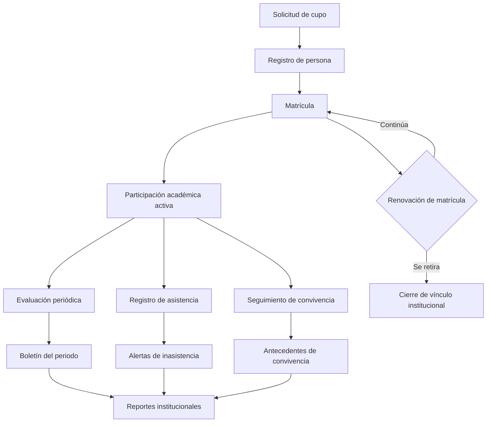
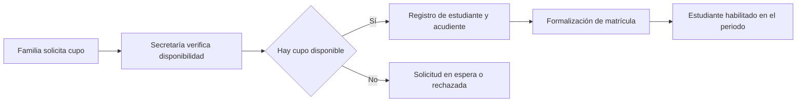
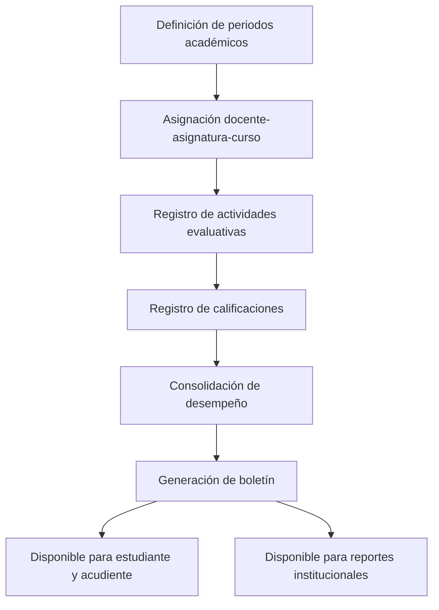
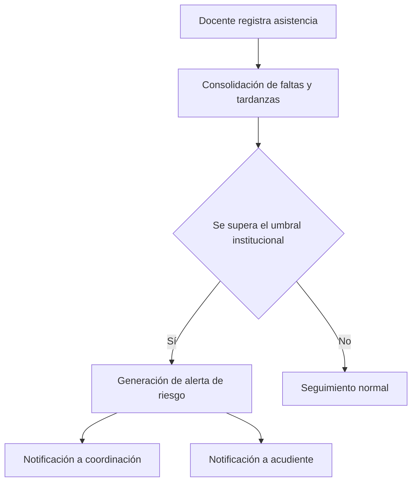
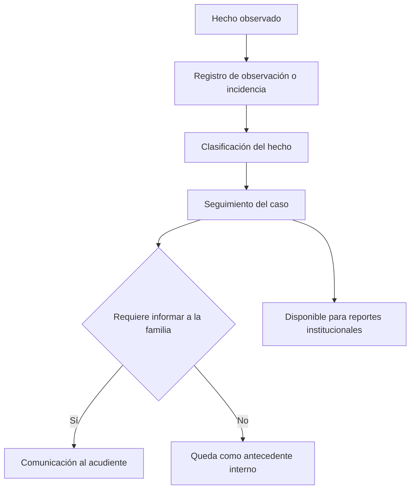
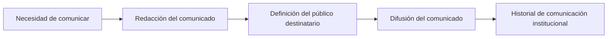

# Arquitectura Funcional del Negocio

## 0. Propósito de este documento

Este documento describe cómo funciona el colegio como negocio y cómo el sistema debe acompañar esa operación. Es un manual funcional, no técnico: no define carpetas, clases, controladores, modelos ni ningún artefacto de implementación. Su propósito es servir como base de entendimiento del negocio para el diseño posterior de roles, permisos, menús, paneles y módulos.

Este documento no reemplaza ni modifica el Manual Oficial de Arquitectura y Estándares de Desarrollo. Ambos documentos son complementarios: uno describe el negocio, el otro describe cómo se construye técnicamente.

## 1. Visión general del negocio

El colegio es una institución educativa que presta un servicio formativo continuo a sus estudiantes, sostenido por un conjunto de procesos administrativos, académicos y de convivencia que se repiten de forma periódica a lo largo del año escolar.

El negocio no consiste únicamente en dictar clases. Consiste en:

- atraer y admitir estudiantes,
- formalizar su permanencia mediante la matrícula,
- organizar la oferta educativa (niveles, cursos, asignaturas, docentes),
- ejecutar el proceso de enseñanza y evaluar el aprendizaje,
- hacer seguimiento a la asistencia y a la convivencia del estudiante,
- comunicar a la comunidad educativa,
- rendir cuentas mediante reportes e indicadores a la dirección institucional,
- proyectar la imagen del colegio hacia el público externo.

El sistema debe ser la columna vertebral de información que conecta estos procesos, de manera que cada actor institucional encuentre en él la información correcta, en el momento correcto, con el nivel de detalle que su función requiere.

El sistema no es un conjunto de pantallas aisladas. Es una plataforma que representa el ciclo de vida completo del estudiante dentro de la institución: desde que es admitido hasta que se gradúa o se retira, pasando por cada periodo académico, cada evaluación, cada inasistencia y cada comunicación recibida.

## 2. Objetivos del sistema

### 2.1 Objetivo general

Sostener digitalmente la operación integral del colegio, garantizando trazabilidad, oportunidad y confiabilidad de la información académica, administrativa y de convivencia de cada estudiante.

### 2.2 Objetivos específicos

1. Formalizar el ingreso y la permanencia del estudiante mediante un proceso de matrícula claro y auditable.
2. Sostener la estructura académica institucional (niveles, cursos, asignaturas, docentes) de forma organizada y vigente.
3. Registrar la evaluación del aprendizaje y producir evidencia oficial del rendimiento del estudiante.
4. Registrar la asistencia y detectar oportunamente riesgos de deserción o ausentismo.
5. Registrar hechos de convivencia y observaciones relevantes para el acompañamiento integral del estudiante.
6. Entregar a la dirección institucional información consolidada para la toma de decisiones.
7. Mantener informada a la comunidad educativa (docentes, estudiantes, familias) de forma oportuna.
8. Proyectar una imagen institucional profesional y actualizada hacia el público externo.
9. Garantizar que cada actor acceda únicamente a la información y a las acciones que corresponden a su rol dentro del negocio.

## 3. Dominios del negocio

El negocio del colegio se organiza en once dominios funcionales. Cada dominio agrupa procesos, información y decisiones que pertenecen a una misma responsabilidad institucional.

### 3.1 Identidad y acceso institucional

Responsable de que cada persona que participa en la vida del colegio tenga una identidad reconocida por la institución y un nivel de acceso correspondiente a su función. Sin este dominio no existe forma confiable de saber quién hace qué dentro del negocio.

### 3.2 Personas y vínculos institucionales

Responsable de mantener la información de las personas que participan en el colegio: estudiantes, docentes, personal administrativo, directivos y acudientes, así como los vínculos entre ellas (por ejemplo, qué acudiente responde por qué estudiante).

### 3.3 Admisiones y matrícula

Responsable de formalizar el ingreso de un estudiante a la institución y de mantener vigente su permanencia periodo tras periodo.

### 3.4 Estructura académica institucional

Responsable de definir cómo está organizada la oferta educativa: niveles, grados, cursos, grupos, asignaturas y horarios.

### 3.5 Gestión pedagógica y curricular

Responsable de vincular al docente con la asignatura y el curso, y de sostener la planeación y la carga académica del proceso de enseñanza.

### 3.6 Evaluación y desempeño académico

Responsable de todo el ciclo de evaluación: periodos, actividades, calificaciones, promedios y boletines.

### 3.7 Asistencia y permanencia del estudiante

Responsable de registrar la asistencia del estudiante y de identificar riesgos de inasistencia o abandono escolar.

### 3.8 Convivencia y seguimiento integral

Responsable de registrar observaciones, incidencias y hechos de convivencia que afectan el desarrollo integral del estudiante, más allá de lo estrictamente académico.

### 3.9 Reportes e inteligencia institucional

Responsable de transformar la información generada por los demás dominios en indicadores, reportes y evidencia útil para la dirección institucional.

### 3.10 Comunicación institucional

Responsable de la difusión de información entre la institución y sus actores: comunicados, notificaciones y avisos.

### 3.11 Portal público e imagen institucional

Responsable de la presencia del colegio ante la comunidad externa: información institucional, noticias y galería pública.

## 4. Procesos completos del negocio

A continuación se describen los procesos de punta a punta que sostienen la operación del colegio. Cada proceso atraviesa uno o más dominios.

### 4.1 Proceso de admisión y matrícula

1. Una familia solicita un cupo para un estudiante.
2. La institución verifica disponibilidad de cupo según nivel, grado o curso.
3. Se registra al estudiante y a su acudiente como personas dentro del colegio.
4. Se formaliza la matrícula del estudiante para el periodo escolar correspondiente.
5. El estudiante queda habilitado para participar en la vida académica.
6. Periodo tras periodo, la matrícula debe renovarse, actualizarse o cerrarse según la permanencia real del estudiante.

### 4.2 Proceso de organización académica institucional

1. La institución define los niveles y grados que ofrecerá en el periodo.
2. Se definen los cursos y grupos correspondientes.
3. Se definen las asignaturas que componen el plan de estudios.
4. Se asignan docentes a cada asignatura y curso.
5. Se define el horario institucional.
6. La estructura queda lista para soportar la matrícula y la evaluación del periodo.

### 4.3 Proceso de enseñanza y evaluación

1. El docente desarrolla su labor pedagógica en el marco de la asignación académica vigente.
2. Se definen los periodos de evaluación del año escolar.
3. El docente registra actividades evaluativas dentro de cada periodo.
4. El docente registra las calificaciones obtenidas por cada estudiante.
5. El sistema consolida los resultados y calcula el desempeño del estudiante.
6. Se generan los boletines oficiales del periodo.
7. Los resultados quedan disponibles para el estudiante, el acudiente y la dirección institucional.

### 4.4 Proceso de asistencia y seguimiento

1. El docente registra la asistencia del estudiante en cada sesión o jornada.
2. El sistema consolida faltas, tardanzas y justificaciones.
3. Se identifican patrones de inasistencia relevantes.
4. Se generan alertas de riesgo de permanencia cuando corresponde.
5. La coordinación y la dirección institucional dan seguimiento a los casos identificados.

### 4.5 Proceso de convivencia y observaciones

1. Un docente, coordinador o secretaría registra un hecho relevante sobre un estudiante.
2. El hecho queda documentado como observación o incidencia.
3. Se hace seguimiento a la evolución del caso.
4. Cuando corresponde, se informa al acudiente.
5. El hecho queda disponible como antecedente para futuras decisiones institucionales.

### 4.6 Proceso de comunicación institucional

1. La institución identifica la necesidad de comunicar algo a la comunidad educativa.
2. Se redacta el comunicado o notificación.
3. Se define el público destinatario.
4. El comunicado se difunde.
5. Queda un histórico de lo comunicado, disponible como evidencia institucional.

### 4.7 Proceso de generación de reportes institucionales

1. La dirección institucional necesita evidencia para tomar una decisión.
2. Se seleccionan los datos relevantes: periodo, curso, estudiante o indicador institucional.
3. El sistema consolida la información proveniente de los distintos dominios.
4. Se produce el reporte o indicador solicitado.
5. La dirección institucional usa el reporte para decidir o rendir cuentas.

### 4.8 Proceso de gestión del portal público

1. La institución decide qué información institucional debe ser visible al público.
2. Se actualiza el contenido institucional, noticias o galería.
3. La comunidad externa consulta la información publicada.
4. La imagen institucional se mantiene vigente y profesional.

## 5. Actores del sistema

El negocio reconoce los siguientes actores:

- Administrador técnico
- Rector
- Coordinador
- Secretaría
- Docente
- Estudiante
- Acudiente

## 6. Responsabilidades de cada actor

### 6.1 Administrador técnico

Responsable de que la operatividad del sistema esté garantizada como soporte del negocio: gestión de accesos, configuración institucional y continuidad del servicio de información. No participa en decisiones pedagógicas ni directivas; su responsabilidad es habilitar que el negocio funcione sin fricción.

### 6.2 Rector

Máxima autoridad institucional. Responsable de dirigir el colegio, revisar el desempeño global de la institución y tomar decisiones estratégicas con base en la información consolidada del sistema.

### 6.3 Coordinador

Responsable de sostener la calidad y continuidad del proceso académico del día a día: organización de cursos, seguimiento docente, seguimiento de riesgo académico y disciplinario.

### 6.4 Secretaría

Responsable de la operación administrativa formal: matrícula, datos de las personas, trámites y soporte documental de los procesos institucionales.

### 6.5 Docente

Responsable de ejecutar el proceso de enseñanza, evaluar a sus estudiantes, registrar asistencia y reportar observaciones relevantes sobre el grupo a su cargo.

### 6.6 Estudiante

Responsable de participar en su propio proceso formativo y de consultar la información relacionada con su desempeño, asistencia y comunicaciones institucionales.

### 6.7 Acudiente

Responsable de acompañar el proceso educativo del estudiante desde el entorno familiar, con base en la información que la institución pone a su disposición.

## 7. Casos de uso por actor

### 7.1 Administrador técnico

- Crear, activar o inactivar cuentas de usuario.
- Configurar parámetros generales de la institución.
- Supervisar la continuidad operativa de la información institucional.
- Administrar el contenido del portal público cuando no existe otro responsable designado.

### 7.2 Rector

- Consultar indicadores institucionales consolidados.
- Revisar el estado de matrícula, evaluación y asistencia a nivel institucional.
- Aprobar o validar decisiones de alto impacto (por ejemplo, cierres de periodo).
- Emitir comunicaciones institucionales estratégicas.

### 7.3 Coordinador

- Revisar el estado académico de los cursos a su cargo.
- Dar seguimiento a alertas de riesgo académico, de asistencia o de convivencia.
- Supervisar el cumplimiento de los procesos de evaluación por parte de los docentes.
- Generar reportes de seguimiento para la dirección institucional.

### 7.4 Secretaría

- Registrar y actualizar estudiantes, docentes y acudientes.
- Gestionar el proceso de matrícula y sus estados.
- Emitir constancias, reportes y soporte documental.
- Actualizar datos de contacto de las familias.

### 7.5 Docente

- Consultar sus asignaciones académicas (asignaturas y cursos a cargo).
- Registrar asistencia de sus estudiantes.
- Registrar actividades y calificaciones.
- Registrar observaciones sobre el comportamiento o desempeño de un estudiante.

### 7.6 Estudiante

- Consultar sus calificaciones y boletines.
- Consultar su historial de asistencia.
- Consultar comunicados institucionales dirigidos a él.

### 7.7 Acudiente

- Consultar el rendimiento académico de su acudido.
- Consultar la asistencia de su acudido.
- Consultar observaciones registradas sobre su acudido.
- Recibir comunicados institucionales.

## 8. Relaciones entre módulos

Los dominios del negocio no son independientes entre sí: cada uno entrega información que otro necesita para funcionar. Las relaciones funcionales principales son:

- Identidad y acceso es prerrequisito de todos los demás dominios, porque ningún actor puede operar en el sistema sin una identidad reconocida.
- Personas es prerrequisito de Admisiones y matrícula, porque no puede matricularse alguien que no está registrado como persona.
- Admisiones y matrícula es prerrequisito de Evaluación, Asistencia y Convivencia, porque estos procesos solo aplican a un estudiante con matrícula vigente.
- Estructura académica es prerrequisito de Gestión pedagógica, porque no puede asignarse un docente a un curso o asignatura que no existe.
- Gestión pedagógica es prerrequisito de Evaluación y de Asistencia, porque ambas dependen de que exista una asignación docente-asignatura-curso vigente.
- Evaluación, Asistencia y Convivencia alimentan a Reportes e inteligencia institucional, que consolida la información para la dirección.
- Comunicación institucional depende de Personas (para saber a quién comunicar) y recibe insumos de Reportes y de Convivencia cuando una situación amerita informar a la familia.
- Portal público depende de Identidad y acceso (para su administración) pero es funcionalmente independiente del resto del negocio interno, ya que su audiencia es externa.

## 9. Flujos del negocio con diagramas

### 9.1 Ciclo de vida del estudiante en la institución

### 9.2 Flujo del proceso de matrícula

### 9.3 Flujo del proceso de evaluación

### 9.4 Flujo de asistencia y alerta temprana

### 9.5 Flujo de convivencia y seguimiento

### 9.6 Flujo de comunicación institucional

## 10. Dependencias funcionales

Las siguientes dependencias funcionales son obligatorias desde el punto de vista del negocio:

1. No puede existir matrícula sin una persona previamente registrada.
2. No puede existir evaluación, asistencia u observación sobre un estudiante sin matrícula vigente en el periodo correspondiente.
3. No puede existir una asignación docente-asignatura-curso sin que exista previamente la estructura académica del periodo (niveles, cursos, asignaturas).
4. No pueden registrarse calificaciones sin un periodo de evaluación definido y una asignación académica vigente.
5. No puede generarse un boletín sin calificaciones consolidadas del periodo.
6. No puede enviarse una comunicación dirigida a una persona que no esté correctamente registrada e identificada en el sistema.
7. Los reportes institucionales dependen de la información generada por matrícula, evaluación, asistencia y convivencia; no son una fuente primaria de datos, sino una consolidación derivada.
8. El acceso de cualquier actor al sistema depende de que su identidad institucional esté activa; ningún proceso de negocio puede ejecutarse por una identidad inactiva.

## 11. Reglas generales del negocio

1. Ningún estudiante puede participar en procesos académicos (evaluación, asistencia, convivencia) sin matrícula vigente.
2. Toda calificación debe estar asociada a un periodo de evaluación oficial y vigente; no se permiten calificaciones fuera de periodo.
3. Todo boletín es un documento oficial y debe reflejar exactamente la información consolidada del periodo al que pertenece.
4. Toda observación o incidencia registrada sobre un estudiante debe quedar como antecedente permanente, sin posibilidad de eliminación silenciosa.
5. Un docente solo puede registrar información académica (asistencia, calificaciones, observaciones) sobre los estudiantes de los cursos y asignaturas que tiene asignados.
6. Un acudiente solo puede consultar información del estudiante o los estudiantes bajo su responsabilidad, nunca de otros estudiantes.
7. Toda comunicación institucional relevante debe quedar registrada en un historial trazable.
8. La información institucional publicada en el portal público debe ser revisada y autorizada antes de su publicación.
9. Ningún actor puede realizar una acción de negocio que no corresponda a su rol institucional, independientemente de que técnicamente tenga acceso al sistema.
10. Toda inactivación de una persona (estudiante, docente, administrativo) debe preservar su historial institucional; inactivar no significa borrar.

## 12. Eventos importantes del negocio

Los siguientes son hechos relevantes que ocurren durante la operación del colegio y que el sistema debe ser capaz de reconocer y sostener:

- Un estudiante es admitido en la institución.
- Un estudiante formaliza su matrícula para un periodo escolar.
- Un estudiante cambia de curso o de grado.
- Un estudiante se retira o cancela su matrícula.
- Se abre un nuevo periodo de evaluación.
- Se cierra un periodo de evaluación.
- Se registra una calificación.
- Se genera un boletín oficial.
- Se registra una inasistencia relevante.
- Se genera una alerta de riesgo de permanencia.
- Se registra una observación o incidencia de convivencia.
- Se emite un comunicado institucional.
- Se activa o inactiva una cuenta de usuario.
- Se publica nuevo contenido en el portal público.
- Se genera un reporte institucional solicitado por la dirección.

## 13. Glosario de términos oficiales

- **Actor institucional**: persona que participa en la operación del colegio con un rol definido (rector, coordinador, secretaría, docente, estudiante, acudiente, administrador técnico).
- **Admisión**: proceso mediante el cual la institución evalúa y acepta el ingreso de un nuevo estudiante.
- **Matrícula**: acto formal que vincula a un estudiante con la institución durante un periodo escolar determinado.
- **Periodo académico**: intervalo de tiempo oficial en el que se organiza la evaluación del año escolar.
- **Estructura académica**: organización institucional de niveles, grados, cursos, grupos y asignaturas.
- **Asignación académica**: vínculo oficial entre un docente, una asignatura y un curso para un periodo determinado.
- **Actividad evaluativa**: instrumento de evaluación registrado dentro de un periodo académico.
- **Calificación**: resultado numérico o cualitativo obtenido por un estudiante en una actividad evaluativa.
- **Boletín**: documento oficial que consolida el desempeño académico de un estudiante en un periodo.
- **Asistencia**: registro de la presencia o ausencia de un estudiante en una jornada o sesión académica.
- **Alerta de riesgo**: señal generada por el sistema cuando un estudiante supera un umbral institucional de inasistencia o bajo desempeño.
- **Observación**: registro de un hecho relevante sobre el comportamiento o desarrollo integral de un estudiante.
- **Incidencia**: hecho de convivencia que requiere seguimiento institucional.
- **Comunicado**: mensaje oficial emitido por la institución hacia uno o varios actores.
- **Reporte institucional**: documento o indicador que consolida información de uno o varios dominios de negocio para apoyar la toma de decisiones.
- **Portal público**: presencia institucional dirigida a la comunidad externa al colegio.
- **Acudiente**: persona responsable de un estudiante ante la institución, generalmente un familiar.
- **Identidad institucional**: representación única y reconocida de una persona dentro del sistema, base de todo acceso y acción en el negocio.
