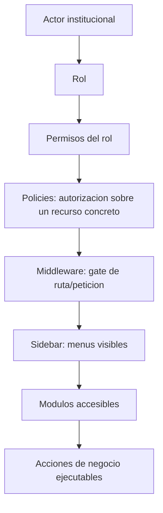
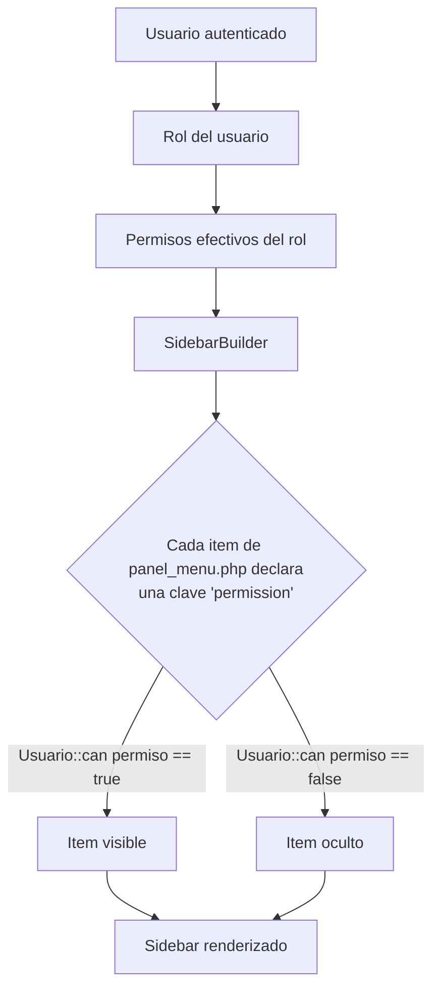
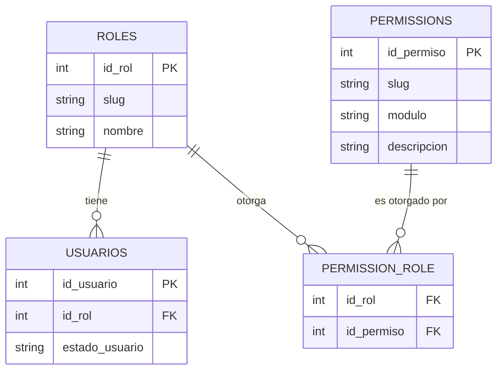
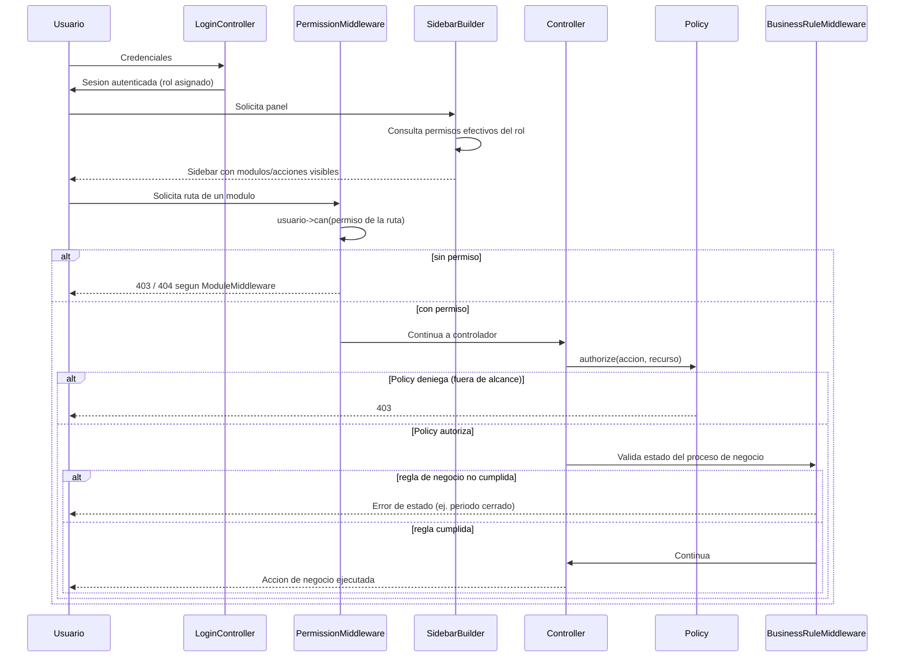
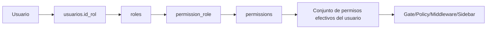

# Diseño Oficial del Modelo RBAC — Fase 3

## 0. Propósito y estado de este documento

Este documento es el **contrato de diseño** de la Fase 3 (RBAC) del Plan Maestro de Implementación ([99-plan-maestro-de-implementacion.md](99-plan-maestro-de-implementacion.md)). Es un documento de **diseño**, no de implementación: no contiene código, no crea migraciones, modelos, policies, middleware, seeders, controllers, requests ni providers, y no modifica ningún archivo del proyecto.

Este documento no reemplaza, reinterpreta ni contradice a los documentos ya aprobados y congelados:

- **Manual Oficial de Arquitectura y Estándares de Desarrollo** ([08-estandares.md](08-estandares.md)) — reglas técnicas obligatorias.
- **Arquitectura Funcional del Negocio** ([02-arquitectura-funcional.md](02-arquitectura-funcional.md)) — dominios, procesos, actores y reglas de negocio.
- **Plan Maestro de Implementación** ([99-plan-maestro-de-implementacion.md](99-plan-maestro-de-implementacion.md)) — orden, fases y estrategia de migración.

Todo lo definido aquí se deriva directamente de esos tres documentos. Donde este documento cita un actor, un dominio o una regla de negocio, esa cita proviene de la Arquitectura Funcional; donde cita una convención de nombres, esa cita proviene del Manual Oficial (sección 6.18 y 6.19).

Una vez aprobado este documento, comienza la implementación de la Fase 3 siguiendo exclusivamente lo aquí descrito.

---

## 1. Estado actual: cómo funciona hoy y por qué no escala

### 1.1 Inventario de lo que existe hoy

- **Middleware de autorización**: un único middleware, [`EnsureRole`](../../laravel/app/Core/Http/Middleware/EnsureRole.php), registrado con el alias `role` en [`bootstrap/app.php`](../../laravel/bootstrap/app.php). Recibe una lista de roles permitidos como parámetros de ruta (`role:admin,rector`) y compara contra `usuario->rolSlug`.
- **Modelo de roles real**: [`Usuario::ROLE_SLUGS`](../../laravel/app/Modules/Auth/Models/Usuario.php) mapea `id_rol` a 7 slugs: `admin`, `rector`, `coordinador`, `secretario`, `docente`, `estudiante`, `acudiente`. Es decir, **los 7 actores de negocio ya están representados como dato**, pero no como autorización funcional.
- **Uso real en rutas**: en [`routes/web.php`](../../laravel/routes/web.php), absolutamente todo el panel administrativo (listados, matrículas, gestión académica, registro, calificaciones, observaciones, boletines, asistencia, estadísticas, comunicados, editar-landing) está protegido con el mismo grupo `role:admin,rector`. No existe una sola ruta protegida con `coordinador`, `secretario`, `docente`, `estudiante` o `acudiente`.
- **Sidebar**: [`SidebarBuilder`](../../laravel/app/Shared/SidebarBuilder.php) ya soporta una clave `roles` por sección/ítem (`rolesAllowed()`), pero [`panel_menu.php`](../../laravel/config/panel_menu.php) no la usa en ningún punto: todo ítem sin `roles` es visible para cualquiera que llegue al sidebar.
- **Autenticación**: [`Usuario`](../../laravel/app/Modules/Auth/Models/Usuario.php) expone `tienePanelAdmin()` (equivalente a `rolSlug in [admin, rector]`) y `estaActivo()`. No existe capa de permisos, Policies, ni Gates.

### 1.2 Cómo funciona hoy, en una frase

El sistema autoriza **por identidad de rol, en bloque, a nivel de grupo de rutas**, con una única distinción binaria: *"admin o rector" vs "todos los demás"*. Los otros 5 actores institucionales ya definidos por la Arquitectura Funcional (coordinador, secretaría, docente, estudiante, acudiente) **no tienen hoy ningún acceso al sistema**, aunque su slug de rol ya existe en el código.

### 1.3 Limitaciones concretas

1. **Autorización binaria, no granular.** `role:admin,rector` no distingue entre "puede ver matrículas" y "puede aprobar matrículas"; quien entra al grupo de rutas puede ejecutar cualquier acción del controlador. Esto contradice directamente la regla de negocio 9 de la Arquitectura Funcional: *"Ningún actor puede realizar una acción de negocio que no corresponda a su rol institucional, independientemente de que técnicamente tenga acceso al sistema."*
2. **No hay control de alcance (scope) por registro.** No existe forma de expresar "un docente solo ve sus asignaciones" o "un acudiente solo ve a su acudido" (reglas de negocio 5 y 6 de la Arquitectura Funcional, sección 11). Hoy esa restricción tendría que codificarse manualmente y de forma dispersa dentro de cada controlador, si es que se codifica.
3. **Los otros 5 actores no tienen portal.** Coordinador, secretaría, docente, estudiante y acudiente son actores de negocio documentados y con casos de uso explícitos (Arquitectura Funcional, sección 7), pero el sistema no les da acceso a nada distinto de lo que ya tiene `admin`/`rector` en bloque, porque simplemente no hay rutas para ellos. Añadir un actor nuevo hoy exigiría reescribir cada grupo de rutas del sistema a mano.
4. **El sidebar no deriva de permisos reales.** La clave `roles` existe en el código de `SidebarBuilder` pero no se usa en `panel_menu.php`. Si mañana se activara para coordinador o docente, cada ítem tendría que declarar manualmente su lista de roles, sin relación con lo que la ruta realmente exige — dos fuentes de verdad que pueden desincronizarse.
5. **No hay Policies.** El Manual Oficial exige (sección 5.2, Policies) que *"toda autorización de negocio debe estar centralizada"* en Policies. Hoy no existe ninguna; la única autorización vive en el middleware de ruta, que no puede expresar reglas a nivel de recurso individual.
6. **Duplicación de listas de roles.** `role:admin,rector` se repite literalmente en más de quince puntos de `routes/web.php`. Añadir un tercer rol con acceso parcial (por ejemplo, que coordinador vea gestión académica pero no configure el portal público) exige tocar rutas una por una, con alto riesgo de inconsistencia — contradice DRY (Manual, sección 3.3).
7. **No escala a permisos de negocio reales.** El negocio define acciones específicas como *cerrar un periodo de evaluación*, *aprobar una matrícula* o *publicar un boletín* (Arquitectura Funcional, sección 12, "Eventos importantes del negocio"). Un middleware de rol no puede expresar "cualquier docente puede registrar notas, pero solo coordinador o rector pueden cerrar el periodo" sin duplicar rutas o introducir condicionales manuales dentro del controlador — justo lo que el Manual prohíbe en la sección 5.2 (Controllers: *"no deben contener lógica de negocio compleja"*).

### 1.4 Conclusión del diagnóstico

La base es aprovechable: los 7 slugs de rol ya existen, el `SidebarBuilder` ya tiene el gancho de filtrado por rol, y la convención de nombres de permisos y roles ya está definida en el Manual Oficial (secciones 6.18 y 6.19). Lo que falta no es reescribir, sino **añadir una capa de permisos granulares sobre la identidad de rol que ya existe**, sin retirar el middleware actual hasta que la nueva capa esté verificada actor por actor (esto ya lo exige el Plan Maestro, sección 9, "Estrategia de Migración").

---

## 2. Modelo RBAC: flujo conceptual completo

El modelo sigue una cadena de responsabilidad de una sola dirección. Cada capa solo conoce a la anterior; ninguna capa "adivina" el trabajo de otra.

- **Rol**: identidad institucional de un usuario (uno de los 7 actores). Un usuario tiene exactamente un rol, igual que hoy (`usuarios.id_rol`).
- **Permisos**: capacidades de negocio con nombre estable (`modulo.accion`), agrupadas por rol. Responden a *"qué tipo de acción puede intentar este actor"*, sin mirar todavía un registro concreto.
- **Policies**: autorización sobre un **recurso específico**. Responden a *"puede este usuario concreto hacer esto sobre este registro concreto"* — aquí es donde vive el alcance (scope): docente sobre su propia asignación, acudiente sobre su propio acudido, estudiante sobre su propio boletín.
- **Middleware**: puerta de entrada a nivel de ruta o grupo de rutas. Responde antes de que se resuelva ningún recurso: *"puede este actor siquiera intentar entrar aquí"*.
- **Sidebar**: capa de presentación. No autoriza nada; **refleja** lo que el usuario ya puede hacer, consultando el mismo permiso que protege la ruta.
- **Módulos y acciones**: el resultado visible y ejecutable final.

El principio rector: **el permiso es la única fuente de verdad**. Middleware, Policies y Sidebar consultan el mismo catálogo de permisos por caminos distintos (petición HTTP, recurso Eloquent, ítem de menú), pero nunca definen autorización por su cuenta.

---

## 3. Catálogo oficial de permisos

Convención de nombres (Manual Oficial, sección 6.18): `modulo.accion` o `modulo.entidad.accion` cuando el módulo agrupa varias entidades de negocio distintas. Ningún permiso se nombra según una vista, una ruta o un componente — solo según la capacidad de negocio que otorga.

El catálogo se organiza por los 13 módulos técnicos actuales de `app/Modules`, indicando a qué dominio de negocio de la Arquitectura Funcional pertenece cada uno (sección 8, "Relaciones entre módulos").

### 3.1 `cuentas` — dominio Identidad y acceso (módulo `Auth`)

| Permiso | Significado de negocio |
|---|---|
| `cuentas.ver` | Consultar cuentas de usuario y su estado. |
| `cuentas.crear` | Crear una cuenta de acceso (habitualmente como parte del alta de una persona). |
| `cuentas.editar` | Modificar datos de acceso de una cuenta (correo, rol asignado). |
| `cuentas.activar` | Reactivar una cuenta inactiva. |
| `cuentas.desactivar` | Inactivar una cuenta (nunca elimina el historial — regla de negocio 10 de la Arquitectura Funcional). |
| `cuentas.asignar_rol` | Cambiar el rol institucional de una cuenta. |
| `cuentas.resetear_password` | Forzar el restablecimiento de contraseña de otra cuenta. |

### 3.2 `usuarios` — dominio Personas y vínculos institucionales (módulo `Usuarios`)

Se subdivide por tipo de persona porque cada una tiene reglas y actores responsables distintos (Arquitectura Funcional, sección 2.2).

| Permiso | Significado de negocio |
|---|---|
| `usuarios.listados.ver` | Ver el listado consolidado de personas (pantalla "Listados"). |
| `usuarios.estudiantes.ver` | Consultar fichas de estudiantes. |
| `usuarios.estudiantes.crear` | Registrar un nuevo estudiante. |
| `usuarios.estudiantes.editar` | Editar datos de un estudiante. |
| `usuarios.estudiantes.activar` / `usuarios.estudiantes.desactivar` | Activar/inactivar un estudiante sin borrar su historial. |
| `usuarios.estudiantes.exportar` | Exportar el listado de estudiantes. |
| `usuarios.docentes.ver` | Consultar fichas de docentes. |
| `usuarios.docentes.crear` | Registrar un nuevo docente. |
| `usuarios.docentes.editar` | Editar datos de un docente. |
| `usuarios.docentes.activar` / `usuarios.docentes.desactivar` | Activar/inactivar un docente. |
| `usuarios.administrativos.ver` | Consultar fichas de personal administrativo. |
| `usuarios.administrativos.crear` | Registrar un nuevo administrativo. |
| `usuarios.administrativos.editar` | Editar datos de un administrativo. |
| `usuarios.administrativos.activar` / `usuarios.administrativos.desactivar` | Activar/inactivar un administrativo. |
| `usuarios.acudientes.ver` | Consultar acudientes. |
| `usuarios.acudientes.vincular` | Vincular un acudiente a un estudiante. |
| `usuarios.acudientes.editar` | Editar datos de contacto de un acudiente. |

### 3.3 `matriculas` — dominio Admisiones y matrícula (módulo `Matriculas`)

| Permiso | Significado de negocio |
|---|---|
| `matriculas.ver` | Consultar matrículas. |
| `matriculas.crear` | Formalizar una nueva matrícula. |
| `matriculas.editar` | Editar datos de una matrícula existente. |
| `matriculas.cambiar_estado` | Cambiar el estado de una matrícula (activa, retirada, etc.). |
| `matriculas.aprobar` | Aprobar formalmente una solicitud de matrícula. |
| `matriculas.exportar` | Exportar el listado de matrículas. |

### 3.4 `gestion_academica` — dominios Estructura académica y Gestión pedagógica (módulo `GestionAcademica`)

| Permiso | Significado de negocio |
|---|---|
| `gestion_academica.materias.ver` / `.crear` / `.editar` / `.activar` / `.desactivar` | Ciclo de vida de asignaturas. |
| `gestion_academica.cursos.ver` / `.crear` / `.editar` / `.activar` / `.desactivar` | Ciclo de vida de cursos/grupos. |
| `gestion_academica.asignaciones.ver` | Consultar asignaciones docente-asignatura-curso. |
| `gestion_academica.asignaciones.crear` | Crear una asignación académica. |
| `gestion_academica.asignaciones.activar` / `.desactivar` | Activar/inactivar una asignación. |
| `gestion_academica.horarios.ver` / `.crear` / `.editar` / `.activar` / `.desactivar` | Ciclo de vida de horarios. |

### 3.5 `calificaciones` — dominio Evaluación y desempeño académico (módulo `Calificaciones`)

| Permiso | Significado de negocio |
|---|---|
| `calificaciones.periodos.ver` | Consultar periodos académicos. |
| `calificaciones.periodos.crear` / `.editar` | Definir o modificar un periodo. |
| `calificaciones.periodos.cerrar_periodo` | Cerrar oficialmente un periodo de evaluación (evento crítico, Arquitectura Funcional sección 12). |
| `calificaciones.tipos_actividad.ver` / `.crear` / `.editar` | Catálogo de tipos de actividad evaluativa. |
| `calificaciones.actividades.ver` | Consultar actividades evaluativas. |
| `calificaciones.actividades.crear` / `.editar` | Definir o modificar una actividad evaluativa. |
| `calificaciones.actividades.activar` / `.desactivar` | Activar/inactivar una actividad. |
| `calificaciones.notas.ver` | Consultar calificaciones (alcance según rol — ver matriz de la sección 4). |
| `calificaciones.notas.registrar` | Registrar calificaciones de una actividad. |
| `calificaciones.notas.editar` | Corregir una calificación ya registrada. |

### 3.6 `boletines` — dominio Evaluación y desempeño académico (módulo `Reportes`)

| Permiso | Significado de negocio |
|---|---|
| `boletines.ver` | Consultar boletines (alcance según rol). |
| `boletines.generar` | Generar el boletín oficial de un periodo. |
| `boletines.publicar` | Publicar un boletín para que sea visible a estudiante/acudiente. |
| `boletines.anular` | Anular un boletín generado por error. |

### 3.7 `asistencia` — dominio Asistencia y permanencia del estudiante (módulo `Asistencia`)

| Permiso | Significado de negocio |
|---|---|
| `asistencia.ver` | Consultar registros de asistencia (alcance según rol). |
| `asistencia.registrar` | Registrar asistencia de una sesión/jornada. |
| `asistencia.editar` | Corregir un registro de asistencia. |
| `asistencia.ver_historial` | Consultar historial consolidado de asistencia. |

### 3.8 `observaciones` — dominio Convivencia y seguimiento integral (módulo `Observaciones`)

| Permiso | Significado de negocio |
|---|---|
| `observaciones.ver` | Consultar observaciones (alcance según rol). |
| `observaciones.crear` | Registrar una observación o incidencia. |
| `observaciones.editar` | Editar una observación existente. |
| `observaciones.activar` / `observaciones.desactivar` | Activar/inactivar una observación (regla de negocio 4: nunca se elimina en silencio). |

### 3.9 `reportes` — dominio Reportes e inteligencia institucional (módulo `Reportes`)

| Permiso | Significado de negocio |
|---|---|
| `reportes.estadisticas.ver` | Consultar estadísticas del sistema. |
| `reportes.institucionales.ver` | Consultar reportes consolidados de nivel institucional (agregados, no transaccionales). |
| `reportes.exportar` | Exportar un reporte. |

### 3.10 `comunicados` — dominio Comunicación institucional (módulo `Comunicados`)

| Permiso | Significado de negocio |
|---|---|
| `comunicados.ver` | Consultar comunicados emitidos. |
| `comunicados.crear` | Redactar un comunicado. |
| `comunicados.publicar` | Difundir un comunicado a su público destinatario. |
| `comunicados.ver_recibidos` | Consultar los comunicados dirigidos al propio usuario (bandeja de entrada). |

### 3.11 `landing` — dominio Portal público e imagen institucional (módulo `Landing`)

| Permiso | Significado de negocio |
|---|---|
| `landing.contenido.editar` | Editar el contenido institucional del portal público. |
| `landing.noticias.crear` / `.editar` / `.activar` / `.desactivar` | Ciclo de vida de noticias públicas. |
| `landing.galeria.crear` / `.editar` / `.activar` / `.desactivar` | Ciclo de vida de la galería pública. |

### 3.12 `dashboard` (módulo `Dashboard`)

| Permiso | Significado de negocio |
|---|---|
| `dashboard.ver` | Acceder al panel de indicadores. El contenido mostrado se adapta al rol (KPIs institucionales para rector, KPIs de curso para docente, etc.), pero el permiso de acceso es único. |

### 3.13 `perfil` (módulo `Perfil`)

`perfil.ver`, `perfil.editar` y `perfil.cambiar_password` **no son permisos de rol**: son capacidades que **todo actor autenticado tiene sobre su propio registro**, sin excepción. No aparecen en la matriz rol→permiso de la sección 4 porque no dependen del rol sino de la propiedad del recurso (ver sección 6, Gates, para cómo se modela esto).

---

## 4. Matriz Rol → Permisos

La matriz se expresa por **grupos de permisos** (no permiso por permiso, para mantenerla legible); el detalle exacto de cada grupo está en la sección 3. "Alcance" indica si el permiso aplica sin restricción de registro o si una Policy limita a qué registros concretos aplica.

### 4.1 Administrador técnico

| Autorizados | Restringidos | Justificación |
|---|---|---|
| `cuentas.*` (todos), `usuarios.*` (todos), `landing.*` (todos), `reportes.estadisticas.ver`, `reportes.exportar`, `dashboard.ver` | `matriculas.aprobar`, `calificaciones.periodos.cerrar_periodo`, `boletines.publicar`, `comunicados.publicar`, `reportes.institucionales.ver` | Es responsable de la operatividad técnica y de accesos (Arquitectura Funcional, 6.1), no de decisiones pedagógicas ni directivas. Administra el portal público "cuando no existe otro responsable designado" (7.1), por eso tiene `landing.*` completo pero no decisiones académicas de fondo. |

### 4.2 Rector

| Autorizados | Restringidos | Justificación |
|---|---|---|
| `reportes.institucionales.ver`, `reportes.estadisticas.ver`, `reportes.exportar`, `matriculas.ver`, `matriculas.aprobar`, `calificaciones.periodos.ver`, `calificaciones.periodos.cerrar_periodo`, `calificaciones.notas.ver` (alcance institucional), `boletines.ver`, `boletines.publicar`, `asistencia.ver_historial`, `observaciones.ver`, `comunicados.*`, `gestion_academica.*.ver`, `dashboard.ver`, `landing.contenido.editar` | `cuentas.crear/editar`, `usuarios.*.crear/editar` (delega en secretaría/admin técnico), `calificaciones.notas.registrar`, `asistencia.registrar` | Máxima autoridad institucional: "revisar el desempeño global... y tomar decisiones estratégicas" y "aprobar o validar decisiones de alto impacto (cierres de periodo)" (Arquitectura Funcional, 6.2 y 7.2). No ejecuta operación transaccional diaria (no registra notas ni asistencia). |

### 4.3 Coordinador

| Autorizados | Restringidos | Justificación |
|---|---|---|
| `gestion_academica.*` (ver y gestionar asignaciones/cursos), `calificaciones.periodos.ver`, `calificaciones.actividades.ver`, `calificaciones.notas.ver` (alcance: cursos a su cargo), `asistencia.ver`, `asistencia.ver_historial`, `observaciones.ver`, `observaciones.crear`, `observaciones.editar`, `reportes.institucionales.ver` (alcance: cursos a su cargo), `reportes.exportar`, `comunicados.ver`, `comunicados.crear`, `dashboard.ver` | `matriculas.aprobar`, `calificaciones.periodos.cerrar_periodo`, `cuentas.*`, `landing.*` | "Asegurar la continuidad y calidad del proceso académico y administrativo diario" y "dar seguimiento a alertas de riesgo académico, de asistencia o de convivencia" (Arquitectura Funcional, 6.3 y 7.3). No aprueba matrícula ni cierra periodos: son decisiones de dirección (rector). |

### 4.4 Secretaría

| Autorizados | Restringidos | Justificación |
|---|---|---|
| `usuarios.estudiantes.*`, `usuarios.acudientes.*`, `usuarios.listados.ver`, `matriculas.ver`, `matriculas.crear`, `matriculas.editar`, `matriculas.cambiar_estado`, `matriculas.exportar`, `reportes.estadisticas.ver` (alcance administrativo), `comunicados.ver`, `comunicados.crear`, `dashboard.ver` | `matriculas.aprobar` (según regla institucional puede requerir validación de rector/coordinador), `usuarios.docentes.*`, `calificaciones.*`, `asistencia.registrar`, `cuentas.asignar_rol` | "Sostener la operación administrativa formal: matrícula, datos de las personas" (Arquitectura Funcional, 6.4). Gestiona personas y matrícula, no la operación pedagógica. |

### 4.5 Docente

| Autorizados | Restringidos | Justificación |
|---|---|---|
| `gestion_academica.asignaciones.ver` (alcance: propias), `calificaciones.actividades.ver/crear/editar` (alcance: propias asignaciones), `calificaciones.notas.ver/registrar/editar` (alcance: propias asignaciones), `asistencia.registrar/ver/editar` (alcance: propias asignaciones), `observaciones.crear/ver/editar` (alcance: estudiantes de sus cursos), `comunicados.ver_recibidos`, `comunicados.crear` (alcance: hacia sus grupos), `dashboard.ver`, `perfil.*` (propio) | `calificaciones.periodos.cerrar_periodo`, `matriculas.*`, `usuarios.estudiantes.crear/editar`, `reportes.institucionales.ver` | Regla de negocio 5 (Arquitectura Funcional, 11): *"Un docente solo puede registrar información académica sobre los estudiantes de los cursos y asignaturas que tiene asignados."* Este alcance no lo da el permiso, lo impone la Policy (sección 5). |

### 4.6 Estudiante

| Autorizados | Restringidos | Justificación |
|---|---|---|
| `calificaciones.notas.ver` (alcance: propias), `boletines.ver` (alcance: propios), `asistencia.ver` (alcance: propia), `observaciones.ver` (alcance: propias), `comunicados.ver_recibidos`, `perfil.*` (propio) | Todo lo demás | "Consultar sus calificaciones y boletines... su historial de asistencia... comunicados institucionales dirigidos a él" (Arquitectura Funcional, 7.6). Es un actor exclusivamente consultivo sobre su propia información. |

### 4.7 Acudiente

| Autorizados | Restringidos | Justificación |
|---|---|---|
| `calificaciones.notas.ver` (alcance: acudidos vinculados), `boletines.ver` (alcance: acudidos vinculados), `asistencia.ver` (alcance: acudidos vinculados), `observaciones.ver` (alcance: acudidos vinculados), `matriculas.ver` (alcance: acudidos vinculados), `comunicados.ver_recibidos`, `perfil.*` (propio) | Todo lo demás | Regla de negocio 6 (Arquitectura Funcional, 11): *"Un acudiente solo puede consultar información del estudiante o los estudiantes bajo su responsabilidad, nunca de otros estudiantes."* Actor exclusivamente consultivo y siempre acotado al vínculo familiar registrado. |

---

## 5. Diseño de Policies

Una Policy por cada tipo de recurso de negocio que requiere autorización a nivel de registro. Solo se listan las acciones que aplican realmente a cada recurso (Manual Oficial, sección 5.2: *"las policies deben ser explícitas y fáciles de auditar"*).

| Policy | Acciones | Alcance (scope) que resuelve |
|---|---|---|
| `CuentaPolicy` | `viewAny`, `view`, `create`, `update`, `activate`, `deactivate`, `assignRole` | Ninguno (siempre institucional; solo administrador técnico). |
| `EstudiantePolicy` | `viewAny`, `view`, `create`, `update`, `activate`, `deactivate` | `view`: docente solo si el estudiante está matriculado en un curso de su asignación vigente; acudiente solo si el estudiante es su acudido; estudiante solo su propio registro. |
| `DocentePolicy` | `viewAny`, `view`, `create`, `update`, `activate`, `deactivate` | Sin alcance especial (secretaría/coordinador/rector/admin ven todos los que su permiso ya autoriza). |
| `AdministrativoPolicy` | `viewAny`, `view`, `create`, `update`, `activate`, `deactivate` | Sin alcance especial. |
| `AcudientePolicy` | `viewAny`, `view`, `create` (vincular), `update` | `view`: el propio acudiente solo su registro. |
| `MatriculaPolicy` | `viewAny`, `view`, `create`, `update`, `approve`, `changeStatus` | `view`: acudiente solo matrículas de sus acudidos; estudiante solo su propia matrícula. |
| `MateriaPolicy`, `CursoPolicy`, `HorarioPolicy` | `viewAny`, `view`, `create`, `update`, `activate`, `deactivate` | Sin alcance especial (son catálogo institucional). |
| `AsignacionAcademicaPolicy` | `viewAny`, `view`, `create`, `activate`, `deactivate` | `view`: docente solo sus propias asignaciones. |
| `PeriodoPolicy` | `viewAny`, `view`, `create`, `update`, `closePeriod` | Ninguno (siempre institucional). |
| `TipoActividadPolicy` | `viewAny`, `create`, `update` | Sin alcance especial. |
| `ActividadPolicy` | `viewAny`, `view`, `create`, `update`, `activate`, `deactivate` | `create`/`update`: docente solo sobre actividades de sus propias asignaciones. |
| `NotaPolicy` | `view`, `register`, `update` | `register`/`update`: docente solo notas de sus asignaciones. `view`: estudiante solo sus notas; acudiente solo notas de sus acudidos. |
| `BoletinPolicy` | `viewAny`, `view`, `generate`, `publish`, `annul` | `view`: estudiante solo su boletín; acudiente solo boletines de sus acudidos. |
| `AsistenciaPolicy` | `view`, `register`, `update`, `viewHistory` | `register`/`update`: docente solo en sus asignaciones. `view`: estudiante propia; acudiente de sus acudidos. |
| `ObservacionPolicy` | `viewAny`, `view`, `create`, `update`, `activate`, `deactivate` | `create`: docente/coordinador/secretaría solo sobre estudiantes con los que tienen vínculo funcional vigente. `view`: estudiante propia; acudiente de sus acudidos. |
| `ReportePolicy` | `view`, `export`, `viewInstitutional` | `viewInstitutional`: coordinador acotado a sus cursos; rector sin acotar. |
| `ComunicadoPolicy` | `viewAny`, `view`, `create`, `publish`, `viewReceived` | `viewReceived`: todo actor solo lo dirigido a él o a un grupo al que pertenece. |
| `LandingContenidoPolicy`, `LandingNoticiaPolicy`, `LandingGaleriaPolicy` | `view`, `update`, `create`, `activate`, `deactivate` | Sin alcance especial. |

`perfil` no tiene Policy propia: es una comprobación de propiedad directa (`$usuario->id === $recurso->id`), no una regla de negocio por rol — se resuelve con un Gate simple (sección 6).

---

## 6. Diseño de Gates

**Regla de decisión (Manual Oficial, sección 5.2, Policies + sección 3.1, principio 5):**

- **Middleware** → gate de **ruta o grupo de rutas**, antes de resolver cualquier recurso. Preguntas de tipo *"¿puede este rol llegar aquí?"* o *"¿está vigente esta cuenta?"*.
- **Policy** → autorización sobre **un recurso Eloquent concreto** (un estudiante, una matrícula, una actividad). Preguntas de tipo *"¿puede este usuario hacer esto sobre este registro?"*. Se usa siempre que exista un modelo de por medio.
- **Gate** → capacidades que **no están atadas a un modelo Eloquent concreto**, o que combinan condiciones transversales que no pertenecen a un único recurso.

### 6.1 Gates que existirán

| Gate | Uso |
|---|---|
| `acceder-panel-admin` | Reemplaza conceptualmente a `tienePanelAdmin()`: determina si el rol del usuario tiene algún permiso de panel administrativo (no de portal estudiante/acudiente). Se usa para decidir el layout/redirección tras login. |
| `gestionar-recurso-propio` | Gate genérico usado por `perfil` y por cualquier pantalla de "mis datos": verifica propiedad directa (`$usuario->id === $modelo->id_usuario`), sin pasar por el catálogo de permisos, porque todo actor autenticado tiene esta capacidad sobre sí mismo. |
| `ver-reportes-institucionales` | Combina el permiso `reportes.institucionales.ver` con la regla de que el alcance (todo vs. solo mis cursos) depende del rol; se apoya en el permiso pero decide el alcance antes de llegar a la Policy de cada reporte. |
| `impersonar-portal-estudiante` *(reservado, no se activa en Fase 3)* | Capacidad futura documentada para si un actor administrativo necesita ver el portal como lo vería un estudiante/acudiente con fines de soporte. No se implementa ahora (YAGNI) — se deja nombrado para no romper la convención si se vuelve necesario. |

Todo lo que no encaje en un Gate de esta lista y tenga un modelo Eloquent detrás usa Policy, no Gate. Esto evita la dispersión que el Manual Oficial prohíbe explícitamente en la sección 3.1, principio 5: *"la lógica de autorización no debe dispersarse."*

---

## 7. Diseño de Middleware

Cuatro middleware, con responsabilidades explícitamente distintas para no duplicar lo que ya resuelve cada capa anterior.

### 7.1 `RoleMiddleware`

- **Qué hace**: valida que el usuario autenticado tenga uno de los roles indicados. Es la evolución con nombre explícito de `EnsureRole` (mismo comportamiento).
- **Cuándo usarlo**: solo para gates gruesos de "familia de actor" que no dependen de una acción de negocio concreta — por ejemplo, distinguir el layout de panel administrativo del portal de estudiante/acudiente. En la Fase 3 convive con el middleware actual (ver sección 9).

### 7.2 `PermissionMiddleware`

- **Qué hace**: valida que el usuario autenticado tenga un permiso concreto del catálogo de la sección 3 (equivalente a `$request->user()->can('matriculas.aprobar')`).
- **Cuándo usarlo**: es el middleware por defecto para **toda ruta nueva o migrada** a partir de la Fase 3. Sustituye a `role:...` ruta por ruta, verificando equivalencia antes de cada reemplazo (Plan Maestro, sección 9, paso 4).

### 7.3 `ModuleMiddleware`

- **Qué hace**: valida que el rol del usuario tenga acceso al **módulo como bloque** (no a una acción puntual), antes de evaluar ningún permiso fino. Responde a *"¿este actor debería siquiera saber que este módulo existe?"*.
- **Cuándo usarlo**: en el punto de entrada (`index`/raíz) de módulos completos que no aplican a todos los actores — por ejemplo, un docente nunca debe llegar a "Editar Landing", ni un estudiante a "Gestión Académica". Evita fugas de información de estructura (nombres de rutas, mensajes 403 sobre recursos que ese actor no debería conocer) devolviendo 404 en vez de 403 cuando el módulo entero no aplica al actor.

### 7.4 `BusinessRuleMiddleware`

- **Qué hace**: valida una **regla de negocio de estado**, no de identidad — por ejemplo, "el periodo de evaluación debe estar abierto para registrar notas" (regla de negocio 2, Arquitectura Funcional, sección 11) o "el estudiante debe tener matrícula vigente" (regla de negocio 1). No pregunta *quién* sino *si el proceso de negocio está en el estado correcto*.
- **Cuándo usarlo**: en acciones de escritura sobre procesos con estados de negocio explícitos (matrícula, periodo académico, boletín). Es deliberadamente distinto de `PermissionMiddleware`: un docente puede tener el permiso `calificaciones.notas.registrar` y aun así no poder ejecutar la acción si el periodo ya está cerrado — eso no es un problema de permisos, es un problema de estado del proceso.

### 7.5 Cuándo se combinan

Una ruta de escritura sensible típica encadena, en este orden: `auth` → `ModuleMiddleware` (¿el actor conoce este módulo?) → `PermissionMiddleware` (¿tiene el permiso?) → controlador → Policy (¿puede sobre este registro específico?) → `BusinessRuleMiddleware`/validación de estado dentro del caso de uso (¿el proceso lo permite ahora?).

---

## 8. Diseño de Sidebar dinámico

El `SidebarBuilder` ya filtra por `roles` a nivel de sección e ítem (`rolesAllowed()`); el cambio de diseño es **qué clave consulta**, no la mecánica de filtrado, que ya es correcta y se conserva.

- Cada ítem, hijo o sección de `panel_menu.php` pasa de declarar `roles => [...]` a declarar `permission => 'modulo.accion.ver'` (una única clave, singular, no una lista — un ítem de menú siempre corresponde a un permiso de consulta del módulo que representa).
- `SidebarBuilder` sustituye `rolesAllowed()` por una comprobación equivalente contra el permiso declarado (`$usuario->can($item['permission'])`), manteniendo exactamente la misma forma de recorrer `top`, `sections`, `items` e `items.children` que ya tiene hoy.
- Si un ítem no declara `permission`, se interpreta como visible para cualquier actor autenticado (igual que hoy el `roles === null` es "visible para todos") — útil para ítems neutros como "Inicio" o "Perfil".
- El sidebar **nunca decide** un permiso nuevo: si el permiso no existe en el catálogo de la sección 3, el ítem no debería existir en el menú. Esto mantiene una sola fuente de verdad entre lo que la ruta exige y lo que el menú muestra.

---

## 9. Compatibilidad y plan de transición

Ningún elemento del sistema actual se retira en esta fase de diseño ni al inicio de su implementación. La convivencia sigue exactamente la estrategia ya aprobada en el Plan Maestro (sección 9, "Estrategia de Migración") y su Sprint 1 (sección 10):

1. **`EnsureRole` (alias `role`) sigue activo sin cambios** mientras se construyen, en paralelo, el catálogo de permisos, las Policies y `PermissionMiddleware`. Ninguna ruta existente cambia de middleware todavía.
2. **`panel_menu.php` sigue usando lo que usa hoy** (nada, porque `roles` no está poblado) hasta que exista el catálogo de permisos verificado; el cambio de `roles` a `permission` en el sidebar es un paso posterior y explícito (Sprint 2 del Plan Maestro, "Sidebar Dinámico"), no parte de esta fase.
3. **Los 7 slugs de rol no cambian de nombre ni de valor.** `admin`, `rector`, `coordinador`, `secretario`, `docente`, `estudiante`, `acudiente` siguen siendo los mismos; el catálogo de permisos se construye *sobre* ellos, no los reemplaza.
4. **Verificación actor por actor antes de retirar nada.** Para cada ruta migrada de `role:admin,rector` a `permission:...`, se valida que el conjunto de usuarios que antes tenía acceso (admin y rector) sigue teniendo acceso equivalente con el nuevo esquema, antes de considerar la migración de esa ruta cerrada.
5. **Los 5 actores sin portal hoy (coordinador, secretaría, docente, estudiante, acudiente) se habilitan de forma aditiva.** No se les "quita" nada porque no tienen nada hoy; se les concede acceso nuevo siguiendo la matriz de la sección 4, sin tocar el comportamiento ya existente de admin/rector.
6. **Retiro del middleware antiguo**: solo cuando **todas** las rutas del sistema usan `PermissionMiddleware`/Policies y el sidebar lee `permission`, se retira `EnsureRole` como código muerto — nunca antes, y nunca como parte de esta fase de diseño.

---

## 10. Diseño de base de datos (modelo conceptual)

No se listan migraciones. Se describe el modelo conceptual y su justificación.

### 10.1 Entidades

- **`roles`**: ya existe (`Rol`, tabla `roles`, PK `id_rol`). Conceptualmente pasa de ser una tabla de solo lectura sin CRUD propio a ser la tabla maestra de los 7 actores institucionales, con `slug` como identificador estable (Manual, sección 6.19).
- **`permissions`** *(nueva)*: catálogo de permisos de la sección 3. Cada fila es un permiso con `slug` único (`modulo.accion`), `modulo` (para agrupar en UI de administración) y `descripcion`.
- **`permission_role`** *(nueva, tabla pivote)*: relación muchos-a-muchos entre `roles` y `permissions`. Es la representación física de la matriz de la sección 4.
- **`usuarios.id_rol`**: ya existe como llave foránea de `usuarios` hacia `roles`. **Se conserva sin cambios**: un usuario sigue teniendo exactamente un rol.

### 10.2 Relaciones

### 10.3 Decisión de diseño: por qué no hay `user_role` ni permisos por usuario individual

El listado de tareas de esta fase menciona `user_role` y una tabla pivote rol↔permiso como posibles tablas a evaluar ("si aplica"). Para la segunda, la decisión de diseño es crear **una única tabla pivote**, sin duplicarla con el nombre invertido; para la primera, la decisión es **no crearla en esta fase**:

- **`user_role` (muchos-a-muchos usuario↔rol) no aplica hoy.** El negocio define 7 actores institucionales mutuamente excluyentes (Arquitectura Funcional, sección 5: cada persona ocupa un rol claro dentro de la operación). No hay un caso de uso documentado de un usuario con más de un rol simultáneo. Introducir la tabla pivote sin necesidad real violaría YAGNI (Manual, sección 3.5: *"no construir capacidades futuras sin una necesidad real y documentada"*). Se mantiene `usuarios.id_rol` como llave simple, exactamente como existe hoy.
- **La tabla pivote rol↔permiso se llama `permission_role`, no `role_permission`.** Es la misma relación muchos-a-muchos descrita en 10.1 y 10.2; el nombre sigue la convención estándar de Eloquent para tablas pivote implícitas (los dos nombres de modelo en singular, orden alfabético — `permission` antes que `role`), coherente con el resto del proyecto Laravel. No se crea una segunda tabla con el nombre invertido: crear ambas sería duplicar conocimiento (Manual, sección 3.3, DRY). `permission_role` es el nombre canónico y físico elegido.
- **No hay tabla de permisos por usuario individual (override).** El catálogo de la sección 3 y la matriz de la sección 4 ya cubren los 7 actores de forma completa. Si en el futuro apareciera una necesidad real y documentada de excepción individual (por ejemplo, un coordinador que también necesita un permiso puntual de docente), se evaluará en ese momento como una extensión aditiva — no se diseña una tabla para un caso hipotético hoy.

Este modelo es intencionalmente el más simple que cubre la matriz de la sección 4 completa, siguiendo KISS (Manual, sección 3.4).

---

## 11. Flujo completo (diagramas)

### 11.1 Autenticación → Autorización → Policy → Sidebar → Módulo → Acción

### 11.2 Resolución de permisos efectivos

---

## 12. Riesgos, ventajas, compatibilidad, escalabilidad e impacto

| Categoría | Detalle |
|---|---|
| **Riesgos** | (1) Migrar rutas de `role:` a `permission:` sin verificar equivalencia puede dejar sin acceso a usuarios activos — mitigado por la verificación actor por actor de la sección 9. (2) Diseñar mal el alcance de una Policy (por ejemplo, un docente viendo notas de estudiantes fuera de su asignación) rompería directamente la regla de negocio 5 — mitigado porque cada Policy de la sección 5 declara explícitamente su alcance antes de implementarse. (3) Poblar mal la matriz rol→permiso al implementarla dejaría a un actor con más o menos acceso del debido — mitigado porque la matriz de la sección 4 es el contrato exacto a implementar, no una guía aproximada. |
| **Ventajas** | Autorización auditable permiso por permiso, no solo por rol amplio. Los 5 actores hoy sin portal (coordinador, secretaría, docente, estudiante, acudiente) quedan listos para habilitarse sin rediseñar autorización de nuevo. Una sola fuente de verdad (`permissions`/`permission_role`) alimenta middleware, Policies y sidebar. |
| **Compatibilidad** | Total con el sistema actual durante toda la Fase 3: `EnsureRole`, `panel_menu.php` y las rutas actuales no se tocan hasta que su reemplazo esté verificado, tal como exige el Plan Maestro (sección 9). |
| **Escalabilidad** | Añadir un permiso nuevo es una fila en `permissions` y filas en `permission_role`, sin tocar código de rutas. Añadir un actor nuevo en el futuro (si el negocio lo definiera) no exigiría rediseñar el modelo, solo poblar su fila en la matriz. |
| **Impacto** | Ninguna interrupción de servicio en esta fase: es diseño puro. El impacto real ocurre en la fase de implementación (Sprint 1 del Plan Maestro) y está acotado por el criterio de finalización de fase ya aprobado (Plan Maestro, sección 7): no se cierra la fase si algún actor pierde acceso que ya tenía. |

---

## 13. Plan de implementación (solo pasos, sin ejecutar)

Alineado con el Sprint 1 del Plan Maestro ("RBAC", 3 semanas, sección 10 de ese documento). No se ejecuta ningún paso como parte de este documento.

1. **Congelar el contrato actual.** Documentar, ruta por ruta, qué `role:...` protege hoy cada grupo (ya recopilado en la sección 1.1 de este documento) como línea base de verificación.
2. **Crear las tablas conceptuales de forma aditiva.** `permissions` y `permission_role` se añaden sin modificar `roles` ni `usuarios` (migración no destructiva, Plan Maestro sección 9, paso 7).
3. **Poblar el catálogo de permisos** de la sección 3 como datos base (seeder de referencia, sin lógica de negocio embebida, Manual sección 6.12).
4. **Poblar la matriz rol→permiso** de la sección 4 como datos base en `permission_role`.
5. **Implementar las Policies** de la sección 5, una por recurso, empezando por los recursos ya usados hoy por admin/rector (Usuarios, Matrículas, Gestión Académica, Calificaciones) antes que por los módulos que hoy nadie usa.
6. **Implementar `PermissionMiddleware`** y registrarlo junto a (no en reemplazo de) `EnsureRole`.
7. **Migrar rutas una por una**, empezando por las de solo lectura (`ver`) antes que las de escritura, verificando equivalencia de acceso para admin/rector en cada una antes de continuar con la siguiente (Plan Maestro, sección 9, pasos 3 a 5).
8. **Habilitar los 5 actores sin portal hoy**, de forma aditiva, siguiendo la matriz de la sección 4, sin modificar el acceso ya migrado de admin/rector.
9. **Implementar `ModuleMiddleware` y `BusinessRuleMiddleware`** sobre los módulos y procesos que lo requieran según las secciones 7.3 y 7.4.
10. **Validar manualmente con un actor real por rol** (mínimo un caso de uso por actor de la sección 4), como exige el criterio de finalización de fase del Plan Maestro (sección 7).
11. **Documentar el resultado** en `docs/arquitectura` como parte del cierre de fase (Plan Maestro, criterio de finalización, punto 6).
12. **No se toca el Sidebar ni `panel_menu.php` en este sprint.** Ese cambio pertenece a la Fase 4 (Sidebar Dinámico) y depende de que este plan esté completo (Plan Maestro, sección 5, dependencia `F3 --> F4`).
13. **Cierre de fase** solo cuando se cumplan todos los puntos del checklist de finalización ya aprobado (Plan Maestro, sección 7) — incluyendo que ningún actor haya perdido acceso que ya tenía.

---

## 14. Conclusión

Este diseño no introduce un modelo de autorización nuevo o ajeno al proyecto: **completa** el modelo que ya estaba parcialmente presente (7 slugs de rol, gancho de `roles` en el sidebar, convención de nombres de permisos y roles ya definida en el Manual Oficial) con la capa que faltaba — permisos granulares, Policies con alcance por registro, y una separación explícita entre "quién puede intentar algo" (permiso), "puede hacerlo sobre este registro" (Policy) y "el proceso de negocio lo permite ahora" (regla de negocio). Es el mismo sistema, con la autorización que la Arquitectura Funcional ya exigía desde su aprobación.
