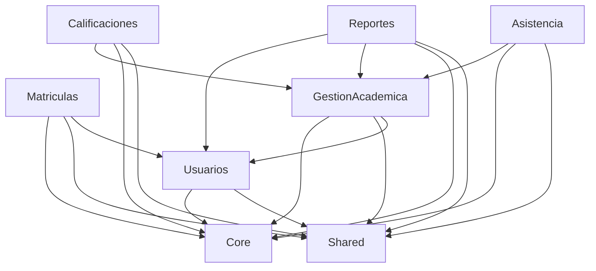
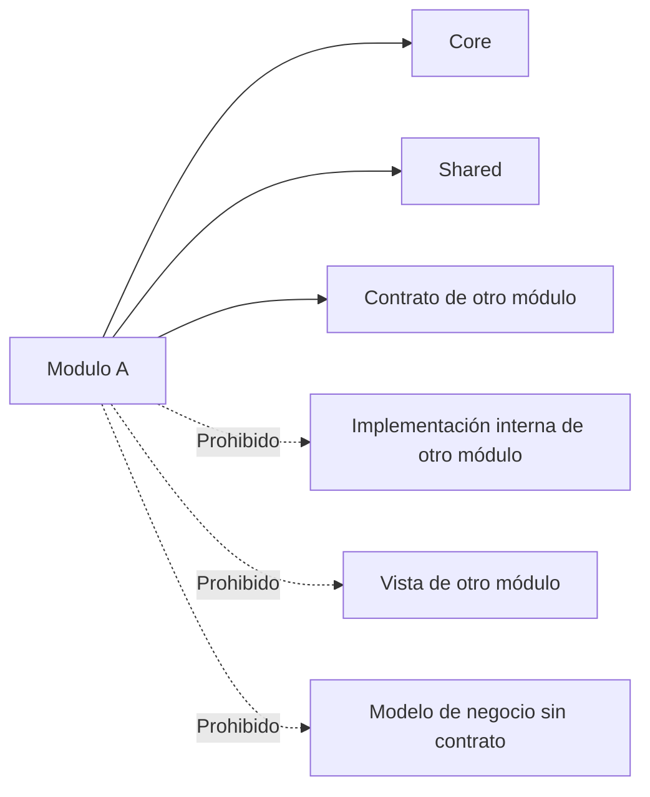

# Manual Oficial de Arquitectura y Estándares de Desarrollo

## 1. Propósito del documento

Este documento define las reglas oficiales de arquitectura, diseño, organización y desarrollo del proyecto Colegio. Su propósito es garantizar que todas las implementaciones futuras sean consistentes, mantenibles, escalables, seguras y alineadas con la estrategia de negocio del sistema escolar.

Este manual es obligatorio para todos los equipos de desarrollo, revisión y mantenimiento. No se considerará una implementación válida si contradice lo aquí establecido.

## 2. Objetivo del proyecto

El proyecto tiene como objetivo implementar un sistema de gestión escolar robusto, modular y escalable que soporte:

- la gestión académica,
- la administración institucional,
- la matrícula y seguimiento del estudiante,
- la evaluación del aprendizaje,
- la asistencia y observaciones,
- la comunicación institucional,
- la generación de reportes y la toma de decisiones.

La arquitectura debe permitir crecer de forma ordenada, sin acoplar funcionalidad de negocio a infraestructura técnica ni a decisiones de implementación temporales.

## 3. Filosofía de la arquitectura

### 3.1 Principios generales

La arquitectura objetivo del proyecto se basa en los siguientes principios:

1. Separación de responsabilidades
   - Cada componente debe tener una responsabilidad clara y única.
   - El negocio no debe mezclarse con detalles técnicos de infraestructura.

2. Bajo acoplamiento y alta cohesión
   - Los módulos deben ser independientes en lo posible.
   - Un cambio en un módulo no debería exigir cambios desproporcionados en otros.

3. Evolución controlada
   - El sistema debe crecer mediante módulos bien definidos y contratos claros.
   - No se debe introducir lógica de negocio en capas transversales innecesarias.

4. Consistencia técnica
   - Todas las implementaciones deben seguir el mismo patrón de organización.
   - La arquitectura debe ser predecible y fácil de revisar.

5. Seguridad por diseño
   - Los permisos, roles y restricciones deben estar explícitos.
   - La lógica de autorización no debe dispersarse.

### 3.2 Principios SOLID

Todos los desarrolladores deben aplicar los principios SOLID en la medida de lo posible:

- S: Responsabilidad Única
  - Una clase o servicio debe tener una razón de cambio.

- O: Abierto/Cerrado
  - El comportamiento debe poder extenderse sin modificar el componente original.

- L: Sustitución de Liskov
  - Los componentes derivados deben poder sustituir a sus bases sin alterar el comportamiento esperado.

- I: Segregación de Interfaces
  - No se debe obligar a implementar métodos innecesarios.

- D: Inversión de Dependencias
  - Las capas de alto nivel no deben depender directamente de implementaciones concretas de bajo nivel.

### 3.3 DRY

No repetir conocimiento o lógica cuando ya existe una abstracción adecuada.

Reglas oficiales:

- No duplicar lógica de negocio en controladores, servicios, jobs o listeners.
- No copiar la misma validación en múltiples puntos.
- Si un comportamiento se usa en más de un lugar, debe centralizarse en un componente apropiado.

### 3.4 KISS

Mantener la solución lo más simple posible, sin perder claridad ni calidad.

Reglas oficiales:

- Evitar complejidad innecesaria.
- Resolver problemas con la solución más comprensible y mantenible.
- No introducir abstracciones solo por abstracción.

### 3.5 YAGNI

No implementar cosas que no sean necesarias ahora para el problema que se está resolviendo.

Reglas oficiales:

- No agregar funciones “por si luego sirven”.
- No construir capacidades futuras sin una necesidad real y documentada.
- No introducir infraestructura o módulos no justificados por requisitos.

### 3.6 Clean Code

El código debe ser legible, explícito, consistente y fácil de mantener.

Reglas oficiales:

- Nombres claros y expresivos.
- Métodos breves y con una única responsabilidad.
- Código simple y directo.
- Comentarios solo cuando aportan contexto real.
- Evitar lógica oscura o “magia”.

### 3.7 Domain Driven Design

El negocio debe organizarse en dominios y subdominios claros.

Reglas oficiales:

- La lógica de negocio debe reflejar el lenguaje del negocio.
- Los conceptos del dominio deben nombrarse con términos del negocio.
- El diseño debe priorizar el modelo de negocio sobre la infraestructura técnica.
- Las reglas del negocio deben residir en el dominio, no en la capa de presentación.

## 4. Organización del proyecto

El proyecto debe organizarse de forma modular y orientada al negocio.

### 4.1 Estructura oficial de alto nivel

La organización esperada es:

- Core
- Shared
- Modules
- Resources
- Config
- Tests
- Docs

### 4.2 Core

Core agrupa componentes transversales, reutilizables y de infraestructura que sostienen la arquitectura del sistema.

Debe contener:

- middleware base,
- excepciones del sistema,
- contratos de infraestructura,
- servicios transversales,
- clases base,
- utilidades de infraestructura,
- abstracciones de persistencia o integraciones.

No debe contener:

- lógica específica de negocio de un módulo,
- modelos de dominio de negocio,
- reglas de negocio para un caso concreto,
- vistas de módulo,
- componentes de presentación.

### 4.3 Shared

Shared contiene componentes reutilizables para varios módulos, pero que no son parte del núcleo de infraestructura del sistema.

Debe contener:

- DTOs compartidos,
- value objects reutilizables,
- enums transversales,
- traits de uso múltiple,
- clases de apoyo comunes,
- helpers de uso general,
- componentes de interfaz reutilizables,
- presentadores o mapeadores compartidos.

No debe contener:

- reglas de negocio específicas de un módulo,
- modelos de dominio particulares,
- lógica de una operación de negocio concreta,
- datos o configuraciones exclusivas de un módulo.

### 4.4 Modules

Modules es la capa central del negocio. Cada módulo representa un contexto funcional o dominio del sistema escolar.

Cada módulo debe ser:

- autónomo en su responsabilidad,
- independiente en lo posible,
- organizado con una estructura clara,
- capaz de evolucionar sin afectar otros módulos innecesariamente.

No debe existir lógica de negocio dispersa en la raíz del proyecto.

### 4.5 Resources

Resources contiene recursos de presentación e infraestructura de interfaz.

Debe incluir:

- vistas Blade,
- componentes Blade,
- assets frontend,
- traducciones,
- plantillas de correo,
- recursos de presentación.

No debe incluir:

- lógica de negocio compleja,
- reglas de dominio,
- acceso directo a base de datos,
- lógica de autorización compleja.

### 4.6 Config

Config contiene la configuración del sistema.

Debe incluir:

- configuraciones de Laravel,
- parámetros del sistema,
- reglas de entorno,
- definiciones de permisos y menús cuando corresponda,
- opciones de servicios externos.

No debe incluir:

- lógica de negocio,
- reglas de dominio,
- transformación de datos compleja.

### 4.7 Tests

Tests contiene la validación formal del sistema.

Debe incluir:

- pruebas unitarias,
- pruebas de características,
- pruebas de integración,
- pruebas de contratos y comportamiento.

No debe incluir:

- lógica de producción,
- mocks que sustituyan el comportamiento real sin justificación,
- pruebas de implementación en lugar de comportamiento.

### 4.8 Docs

Docs contiene la documentación oficial del sistema.

Debe incluir:

- arquitectura,
- decisiones de diseño,
- manuales,
- guías de implementación,
- reglas de negocio o operativas,
- procesos de despliegue y soporte.

No debe incluir:

- código ejecutable,
- archivos de configuración de producción,
- contenido temporal o experimental.

## 5. Estándares de módulos

Cada módulo debe seguir una estructura oficial y consistente.

### 5.1 Estructura base recomendada por módulo

Cada módulo debe contar con una estructura mínima y explícita:

```text
Modules/{Modulo}/
├── Controllers/
├── Services/
├── Actions/
├── Repositories/
├── Models/
├── Http/
│   └── Requests/
├── Policies/
├── Resources/
├── Routes/
├── Views/
├── Providers/
├── Events/
├── Listeners/
├── Observers/
├── Notifications/
├── Jobs/
├── Tests/
├── Contracts/
├── DTO/
├── Enums/
├── Traits/
├── Support/
```

### 5.2 Responsabilidad de cada componente

#### Controllers

Responsables de recibir la solicitud, coordinar la interacción y devolver una respuesta.

Reglas:

- No deben contener lógica de negocio compleja.
- No deben realizar operaciones de base de datos directamente si existe un servicio o acción apropiado.
- Deben delegar en servicios o acciones.
- Deben validar entrada mediante Requests.

#### Services

Responsables de orquestar operaciones de negocio de cierta complejidad.

Reglas:

- Deben encapsular lógica de negocio significativa.
- Pueden coordinar varios repositorios, eventos o acciones.
- No deben contener lógica de presentación.
- No deben ser “cajas de métodos” vacías.

#### Actions

Responsables de ejecutar una acción específica del dominio.

Reglas:

- Cada acción debe representar una unidad de negocio concreta.
- Deben ser pequeñas, explícitas y reutilizables.
- Idealmente, una acción representa un caso de uso.
- Deben evitar depender de la capa de presentación.

#### Repositories

Responsables de abstraer el acceso a almacenamiento y persistencia.

Reglas:

- No deben contener lógica de negocio.
- Deben encapsular consultas y operaciones de persistencia.
- Las reglas de negocio no deben vivir aquí.
- Deben trabajar con contratos cuando sea necesario.

#### Models

Representan entidades o agregados del dominio.

Reglas:

- Deben reflejar conceptos del negocio.
- No deben contener lógica de negocio extensa.
- Pueden implementar reglas simples de alcance o validación de dominio cuando aporten claridad.
- Deben estar alineados con el lenguaje del negocio.

#### Requests

Representan validaciones de entrada y reglas de formulario o petición.

Reglas:

- Toda entrada importante debe pasar por un Request.
- Los Request deben validar estructura, tipos, requerimientos y reglas de negocio de entrada.
- Los controladores no deben validar manualmente datos complejos.

#### Policies

Definen permisos y autorización sobre recursos.

Reglas:

- Toda autorización de negocio debe estar centralizada aquí.
- No se debe autorizar directamente en el controlador si existe una policy.
- Las policies deben ser explícitas y fáciles de auditar.

#### Resources

Representan transformaciones o formatos de salida de un recurso para consumo externo o de presentación.

Reglas:

- No deben contener lógica de negocio.
- Su propósito es transformar datos para presentación o integración.
- No deben ser el lugar para implementar reglas del dominio.

#### Routes

Definen los endpoints o rutas del módulo.

Reglas:

- Las rutas deben agruparse por módulo.
- Deben usar nombres claros y consistentes.
- No deben contener lógica de negocio.
- La ruta debe invocar un controlador o acción apropiada.

#### Views

Contienen la presentación de la interfaz.

Reglas:

- No deben contener lógica de negocio.
- Deben ser simples y declarativas.
- La lógica de decisión debe moverse a servicios o acciones.

#### Providers

Reglas de registro y vinculación del módulo con el framework y el sistema.

Reglas:

- Deben registrar servicios, bindings, rutas, políticas y configuraciones del módulo.
- No deben contener lógica de negocio.

#### Events

Representan hechos relevantes del dominio.

Reglas:

- Deben nombrar cambios o hechos del negocio.
- No deben contener comportamiento ejecutable.

#### Listeners

Responden a eventos y ejecutan lógica secundaria.

Reglas:

- Deben ser simples y orientados a una responsabilidad específica.
- No deben implementar reglas de negocio principales.

#### Observers

Responden a eventos del modelo relacionados con ciclo de vida de entidades.

Reglas:

- Se usan para automatizar acciones derivadas de cambios en modelos.
- Deben ser limitados y claros.

#### Notifications

Gestionan mensajes o comunicaciones externas al sistema.

Reglas:

- Se usan para correos, mensajes, alertas o notificaciones.
- No deben ser el lugar central del negocio.

#### Jobs

Procesos asíncronos o de larga duración.

Reglas:

- Se usan para tareas no inmediatas.
- Deben encapsular un flujo claro.
- No deben incluir lógica de negocio compleja que pueda resolverse en una acción o servicio.

#### Tests

Validación de comportamiento y calidad.

Reglas:

- Deben existir para comportamiento crítico y reglas relevantes.
- Las pruebas deben validar el resultado observable.
- No deben reemplazar diseño ni arquitectura.

#### Contracts

Definen contratos de interacción entre módulos o capas.

Reglas:

- Deben usarse para abstraer dependencias.
- Permiten disminuir el acoplamiento.
- Los módulos deben depender de contratos, no de implementaciones concretas.

#### DTO

Objetos de transferencia de datos.

Reglas:

- Se usan para mover datos entre capas.
- Deben ser explícitos y con nombres claros.
- No deben contener lógica de negocio compleja.

#### Enums

Enumeraciones de dominio o negocio.

Reglas:

- Para estados, tipos, categorías y valores controlados.
- Deben evitar el uso de strings dispersos para conceptos del sistema.

#### Traits

Comportamientos reutilizables pequeños.

Reglas:

- Solo para lógica pequeña y transversal.
- No deben ocultar reglas de negocio importantes.
- Deben usarse con moderación.

#### Support

Soporte interno del módulo.

Reglas:

- Se usa para clases auxiliares del módulo que no encajan en otras capas.
- Debe mantenerse limpio y acotado.
- No debe convertirse en “cajón de objetos”.

## 6. Convenciones oficiales

### 6.1 Nombres de carpetas

Reglas oficiales:

- Usar PascalCase para módulos y carpetas de dominio.
- Usar nombres descriptivos y en singular cuando representen una entidad.
- Evitar nombres genéricos como utils, misc o helpers sin contexto.
- Mantener consistencia entre módulos.

Ejemplos:

- Modules/Usuarios
- Modules/GestionAcademica
- Modules/Calificaciones

### 6.2 Nombres de clases

Reglas oficiales:

- Todas las clases deben usar PascalCase.
- Los nombres deben ser explícitos y reflejar su responsabilidad.
- Evitar nombres ambiguos como Handler, Process, Data.

Ejemplos:

- CrearEstudianteAction
- MatriculaService
- EstudianteRepository
- RegistroEstudianteRequest

### 6.3 Nombres de controladores

Reglas oficiales:

- Todos los controladores deben terminar en Controller.
- Deben nombrarse por su responsabilidad o caso de uso principal.
- No deben incluir lógica de negocio.

Ejemplos:

- EstudiantesController
- MatriculasController
- PerfilController

### 6.4 Modelos

Reglas oficiales:

- Los modelos deben usar nombres en singular y PascalCase.
- Deben representar entidades o agregados del negocio.
- No deben encapsular toda la lógica del sistema.
- Las relaciones deben ser claras y fáciles de entender.

Ejemplos:

- Estudiante
- Profesor
- AsignacionAcademica

### 6.5 Requests

Reglas oficiales:

- Deben terminar en Request.
- Deben ser usados para toda entrada importante.
- El nombre debe indicar el contexto de la petición.

Ejemplos:

- CrearEstudianteRequest
- ActualizarUsuarioRequest

### 6.6 Policies

Reglas oficiales:

- Deben terminar en Policy.
- Deben nombrarse según el recurso que protegen.

Ejemplos:

- EstudiantePolicy
- MatriculaPolicy

### 6.7 Repositories

Reglas oficiales:

- Deben terminar en Repository.
- Deben abstraer acceso a datos.
- No deben implementar reglas de negocio.

Ejemplos:

- EstudianteRepository
- CursoRepository

### 6.8 Services

Reglas oficiales:

- Deben terminar en Service.
- Deben concentrar lógica de negocio o coordinación de alto nivel.
- Deben ser usados cuando un caso de uso requiera más que una simple acción.

Ejemplos:

- EstudianteRegistroService
- MatriculaService

### 6.9 Actions

Reglas oficiales:

- Deben terminar en Action.
- Deben tener un propósito claro, idealmente un caso de uso.
- Se recomienda que una acción haga una sola cosa bien.

Ejemplos:

- CrearMatriculaAction
- ActualizarEstadoAsistenciaAction

### 6.10 Migraciones

Reglas oficiales:

- Deben nombrarse con prefijo de fecha y nombre descriptivo en snake_case.
- Deben responder a un cambio claro del esquema.
- Deben ser atómicas y reversibles cuando sea posible.

Ejemplo:

- 2026_07_20_create_matriculas_table.php

### 6.11 Factories

Reglas oficiales:

- Deben terminar en Factory.
- Deben representar datos de prueba coherentes con el dominio.
- No deben usarse para generar datos irreales sin contexto.

Ejemplo:

- EstudianteFactory

### 6.12 Seeders

Reglas oficiales:

- Deben terminar en Seeder.
- Deben cargar datos base o de referencia con intención clara.
- No deben ocultar lógica empresarial compleja.

Ejemplo:

- RolesSeeder

### 6.13 Tests

Reglas oficiales:

- Deben terminar en Test.
- Deben agruparse por tipo: Unit, Feature o Integration.
- Deben probar comportamientos y reglas relevantes.

Ejemplos:

- EstudianteRegistroTest
- MatriculaPolicyTest

### 6.14 Namespaces

Reglas oficiales:

- Los namespaces deben reflejar la estructura del proyecto.
- Deben seguir esta convención:

```text
App\Modules\{Modulo}\{Capa}
App\Core\{Capa}
App\Shared\{Capa}
```

Ejemplos:

- App\Modules\Usuarios\Controllers
- App\Modules\Matriculas\Services
- App\Core\Http\Middleware

### 6.15 Archivos Blade

Reglas oficiales:

- Los archivos Blade deben nombrarse en kebab-case o snake_case según el contexto del proyecto.
- Deben ser descriptivos y reflejar la vista que representan.
- No deben contener lógica compleja.

Ejemplos:

- estudiantes-index.blade.php
- registro-estudiante.blade.php

### 6.16 Componentes Blade

Reglas oficiales:

- Deben terminar en un nombre claro y reutilizable.
- Deben ser autónomos y composables.
- No deben asumir lógica de negocio interna.

Ejemplos:

- alert-card.blade.php
- sidebar-nav.blade.php

### 6.17 Rutas

Reglas oficiales:

- El nombre de la ruta debe ser claro y consistente.
- Debe seguir el patrón de negocio del módulo.
- No deben definirse rutas sueltas o dispersas sin contexto.

Ejemplo:

- usuarios.estudiantes.index

### 6.18 Permisos

Reglas oficiales:

- Los permisos deben nombrarse en formato estable y explícito.
- Deben seguir una convención de negocio.
- No deben depender de nombres de vista o de componentes.

Ejemplo:

- usuarios.create
- matriculas.aprobar

### 6.19 Roles

Reglas oficiales:

- Los roles deben representarse con identificadores estables y explícitos.
- No deben mezclarse con permisos ni con nombres de vistas.
- El sistema debe usar un modelo de roles claro y auditable.

Ejemplo:

- administrador_tecnico
- rector
- coordinador
- docente
- estudiante
- acudiente

## 7. Dependencias permitidas

La arquitectura debe impedir que los módulos se vuelvan dependientes unos de otros por accidente.

### 7.1 Reglas generales de dependencia

Un módulo puede depender de:

- su propio dominio,
- Core,
- Shared,
- contratos de otros módulos cuando exista una integración legítima,
- infraestructura transversal.

### 7.2 Dependencias permitidas



### 7.3 Dependencias prohibidas

Las siguientes dependencias están prohibidas:

- un módulo no puede depender directamente del modelo o de la implementación interna de otro módulo cuando existe una capa de abstracción apropiada;
- un módulo no puede depender de la capa de presentación de otro módulo;
- un módulo no puede importar lógica de negocio de otro módulo sin contrato explícito;
- no se permiten dependencias circulares;
- no se permiten dependencias de infraestructura desde la capa de negocio sin control explícito.

### 7.4 Diagrama de restricciones



## 8. Reglas para Shared

Shared debe ser una capa de reutilización controlada.

### 8.1 Debe vivir en Shared

- DTOs compartidos,
- value objects comunes,
- enums generales,
- traits reutilizables,
- helpers generales,
- clases de soporte transversal,
- presentadores o transformers compartidos,
- componentes de interfaz reutilizables.

### 8.2 Nunca debe vivir en Shared

- lógica específica de un módulo,
- reglas de negocio concretas,
- validaciones únicas de una entidad,
- modelos de negocio particulares,
- servicios de negocio con contexto específico,
- controladores o vistas de módulo.

## 9. Reglas para Core

Core debe concentrar lo que sostiene la arquitectura del sistema.

### 9.1 Debe vivir en Core

- middleware de infraestructura,
- excepciones del sistema,
- interfaces de infraestructura,
- abstracciones de persistencia,
- contratos de integración,
- clases base de aplicación,
- servicios transversales comunes.

### 9.2 No debe vivir en Core

- reglas del negocio escolar,
- entidades del negocio,
- operaciones específicas de matrícula, calificaciones o asistencia,
- vistas, componentes visuales o recursos de presentación,
- controladores de módulo.

## 10. Reglas para crear un nuevo módulo

Todo módulo nuevo debe crearse siguiendo este proceso obligatorio.

### 10.1 Paso 1: Definir el contexto de negocio

Antes de crear el módulo, se debe responder:

- ¿Qué problema de negocio resuelve?
- ¿Qué entidad o proceso representa?
- ¿Qué otros módulos se relacionan con él?
- ¿Qué reglas de negocio deben existir ahí?

### 10.2 Paso 2: Definir el alcance del módulo

El módulo debe tener:

- un objetivo claro,
- responsabilidades delimitadas,
- acuerdos de interacción con otros módulos,
- un conjunto explícito de permisos y roles.

### 10.3 Paso 3: Crear la estructura oficial

Debe crearse la estructura mínima descrita en este manual. No se deben crear carpetas improvisadas.

### 10.4 Paso 4: Definir contratos de integración

Si el módulo interactúa con otros, debe definir contratos claros.

### 10.5 Paso 5: Definir reglas de autorización

Debe identificarse:

- qué roles acceden,
- qué permisos existen,
- qué recursos se protegen,
- qué acciones están permitidas o no.

### 10.6 Paso 6: Definir pruebas

Todo módulo nuevo debe incluir pruebas mínimas que cubran:

- caso de uso principal,
- reglas de autorización,
- comportamiento crítico,
- fallo esperado.

### 10.7 Paso 7: Documentar la integración

El módulo debe quedar documentado en la arquitectura del proyecto y en su propia guía de uso o alcance si aplica.

## 11. Checklist obligatorio para Pull Requests

Todo cambio debe pasar esta revisión antes de fusionarse.

### 11.1 Arquitectura

- [ ] El cambio respeta la estructura modular definida.
- [ ] No se introducen dependencias prohibidas.
- [ ] La lógica de negocio está en la capa correcta.
- [ ] No se mezcla presentación con negocio.

### 11.2 Calidad

- [ ] El código cumple con los principios SOLID.
- [ ] Se evita duplicación innecesaria.
- [ ] El cambio es simple y comprensible.
- [ ] Se utilizan nombres claros y consistentes.

### 11.3 Seguridad

- [ ] Se respetan permisos y políticas.
- [ ] No se expone información sensible.
- [ ] Las entradas están validadas.
- [ ] Se evita la lógica insegura o no autorizada.

### 11.4 Pruebas

- [ ] Existen pruebas relevantes para el cambio.
- [ ] Las pruebas cubren el comportamiento esperado.
- [ ] No se introducen regresiones evidentes.

### 11.5 Documentación

- [ ] El cambio está documentado si afecta arquitectura o negocio.
- [ ] Los nuevos módulos o flujos quedan explicados.
- [ ] La documentación refleja la realidad del sistema.

## 12. Buenas prácticas oficiales

### 12.1 Diseño

- Preferir claridad sobre sofisticación.
- Mantener el diseño alineado con el dominio.
- Resolver problemas de forma explícita.
- Descomponer problemas complejos en unidades pequeñas.

### 12.2 Código

- Escribir código que sea fácil de leer por otro desarrollador.
- Evitar comentarios innecesarios.
- Usar nombres basados en intención.
- Mantener métodos y clases con propósito claro.

### 12.3 Negocio

- Los cambios deben reflejar el negocio y no solo la tecnología.
- Las reglas comerciales deben expresarse de forma comprensible.
- El diseño debe facilitar cambios futuros sin reescrituras masivas.

### 12.4 Mantenimiento

- Mantener la arquitectura limpia y predecible.
- Evitar soluciones temporales que se vuelvan permanentes.
- Revisión y mejora continua.

### 12.5 Colaboración

- Todo cambio debe ser comprensible por el equipo.
- La arquitectura no debe depender de una sola persona.
- La documentación debe mantenerse al día.

## 13. Normas de cumplimiento

Este manual es vinculante para todas las implementaciones futuras.

Toda propuesta de cambio debe responder a estas preguntas:

1. ¿Está alineada con la arquitectura del negocio?
2. ¿Responde a un propósito claro?
3. ¿Se integra con el modelo de módulos y capas?
4. ¿Respeta los principios de calidad y seguridad?
5. ¿Puede mantenerse sin crear deuda técnica innecesaria?

Si una implementación no cumple con estas preguntas, debe replantearse antes de avanzar.

## 14. Conclusión

El sistema debe construirse como una arquitectura modular, empresarial y mantenible. La organización por módulos, la separación entre negocio e infraestructura, el uso de contratos claros y la documentación formal son condiciones necesarias para garantizar una evolución saludable del proyecto.

Este documento es la base oficial para el desarrollo futuro y debe ser consultado como referencia obligatoria en cada implementación.
