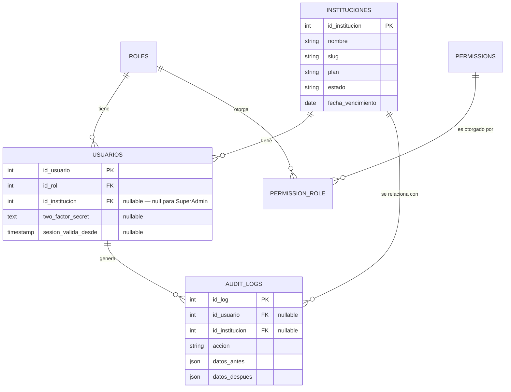

# SuperAdmin y Plataforma Multi-Tenant — Fase A

## 0. Propósito y estado de este documento

Este documento registra una decisión de arquitectura ya implementada (no es un documento de solo diseño, a diferencia de [03-rbac.md](03-rbac.md)): el pivote del sistema de "un solo colegio" a una plataforma que aloja múltiples instituciones, cada una administrada por sus propios actores institucionales (los 7 ya descritos en [02-arquitectura-funcional.md](02-arquitectura-funcional.md)), y todas supervisadas por un 8º actor de plataforma: **SuperAdmin**.

Este documento **no reemplaza** [02-arquitectura-funcional.md](02-arquitectura-funcional.md), [03-rbac.md](03-rbac.md) ni [08-estandares.md](08-estandares.md) — los complementa, igual que `03-rbac.md` complementó a `02` sin pisarlo. En particular: los 7 actores institucionales, sus casos de uso y la matriz de permisos de `03-rbac.md` siguen siendo exactamente los mismos: SuperAdmin se añade **por encima**, no los modifica.

## 1. Por qué existe esta fase

El sistema fue diseñado y construido para un solo colegio (`colegio_configuracion`, fila única `id=1`). Convertirlo en una plataforma real para muchas instituciones exige dos cosas distintas:

1. **Un registro de instituciones (tenants)** con su propio ciclo de vida (alta, plan, licencia, vencimiento, suspensión).
2. **Un actor de plataforma** que administre ese registro, los usuarios de todas las instituciones y la configuración global — sin mezclarse con la autorización de "Administrador técnico" (que sigue siendo el rol técnico de **una** institución, no de la plataforma).

## 2. Alcance de la Fase A (esta entrega)

| Incluido | No incluido (Fase B, pendiente) |
|---|---|
| Modelo `Institucion` (tenant) + registro de instituciones | Aislamiento real de datos por institución en los ~13 módulos de negocio existentes (estudiantes, matrículas, gestión académica, calificaciones, asistencia, observaciones, comunicados, calendario, landing...) |
| `usuarios.id_institucion` (nullable) | `id_institucion` en las tablas de esos módulos |
| 8º rol `superadmin` (`id_rol=8`), separado de los 7 actores institucionales | Multi-tenancy real a nivel de consulta (global scope aplicado módulo a módulo) |
| Panel SuperAdmin completo: instituciones, usuarios globales, matriz de roles/permisos, auditoría, métricas, configuración de plataforma, catálogo de planes y módulos | Facturación/pagos reales (no hay pasarela de pago en el proyecto; `plan`/`fecha_vencimiento`/`limite_usuarios` son metadata, no cobro) — el catálogo de planes (§9) sigue siendo metadata, no cambia esto |
| Auditoría (`audit_logs`) de acciones críticas de SuperAdmin | Auditoría de acciones dentro de cada institución (matrícula, calificaciones...) — sigue sin existir, no es parte de esta fase |
| 2FA (TOTP) + rate limiting + invalidación de sesión por cambio de rol/permisos | 2FA obligatorio u ofrecido a los 7 actores institucionales (se dejó el mecanismo listo en `usuarios`, pero solo se expone en el panel SuperAdmin) |

La Fase B es del mismo tamaño que el propio Plan Maestro de 15 fases ([99-plan-maestro-de-implementacion.md](99-plan-maestro-de-implementacion.md)) — migrar cada módulo de negocio a estar acotado por institución, módulo a módulo, verificando que ningún actor pierda acceso al hacerlo, exactamente con la misma estrategia de migración no destructiva que ese documento ya exige para RBAC.

## 3. Modelo de datos

- **`instituciones`**: registro de tenants. La institución `#1` es el colegio que ya operaba el sistema antes de esta fase (creada automáticamente por la migración, leyendo `colegio_configuracion`).
- **`usuarios.id_institucion`**: nullable a propósito — el SuperAdmin no pertenece a ninguna institución, opera la plataforma completa. Todo usuario preexistente quedó asignado a la institución `#1` (backfill en la propia migración, sin paso manual).
- **`roles`**: se suma `id_rol=8` (`SuperAdmin`) a los 7 ya existentes. `Usuario::ROLE_SLUGS` y `Usuario::ROLES_PANEL_ADMIN` no cambian de significado — `esSuperAdmin()` es un método nuevo, separado de `tienePanelAdmin()`.
- **`permissions`/`permission_role`**: existían migradas y sembradas pero **sin ningún consumidor real** (confirmado en `03-rbac.md §1.1`). Esta fase es el primer consumidor real: el catálogo `plataforma.*` (instituciones, usuarios_globales, roles, auditoría, métricas, configuración) se otorga exclusivamente al rol SuperAdmin.
- **`audit_logs`**: bitácora append-only (mismo patrón que `evento_historial`) de acciones críticas de plataforma.
- **`plataforma_configuracion`**: registro único (mismo patrón que `colegio_configuracion`) para límites de plan por defecto y plantilla de comunicado global. Deliberadamente **no** incluye credenciales de integraciones — WhatsApp Cloud API sigue viviendo en `.env`/`config('services.whatsapp_cloud')`, el panel solo muestra su estado.

## 4. Autorización — capa separada de `EnsureRole`

Decisión explícita de diseño: SuperAdmin **no reutiliza** el middleware `role:...` que protege el panel institucional. Tres piezas nuevas en `App\Core\Http\Middleware`:

| Middleware | Alias | Uso |
|---|---|---|
| `EnsureSuperAdmin` | `superadmin` | Gate de "familia de actor" para todo el grupo `/superadmin/*` — equivalente a `EnsureRole` pero sin mezclar la lista de roles institucionales. |
| `EnsurePermission` | `permission` | Primera implementación real de `PermissionMiddleware`, diseñado en `03-rbac.md §7.2` y nunca implementado. Se usa **solo** en rutas de SuperAdmin — ninguna ruta `role:admin,rector` existente se migró como parte de esta fase. |
| `EnsureSessionFresh` | (global, grupo `web`) | No-op para cualquier usuario con `sesion_valida_desde` nulo (los 7 roles institucionales, sin cambios). Cuando SuperAdmin cambia el rol o los permisos de una cuenta, ese timestamp se estampa y la sesión activa de esa cuenta se invalida en la siguiente petición. |

Policies nuevas (primeras del proyecto — `03-rbac.md` diseñaba Policies pero ninguna existía en código): `InstitucionPolicy` y `AuditLogPolicy`, registradas explícitamente vía `Gate::policy()` en `AppServiceProvider`. `UsuarioGlobalPolicy`, `RolPermisoPolicy` y `ConfiguracionPlataformaPolicy` se invocan manualmente desde su controlador (no vía `Gate::policy()`) para no colisionar con la futura `CuentaPolicy` oficial de `03-rbac.md §5`, que en su momento será la Policy real del modelo `Usuario`.

La bandeja de soporte (`/soportes/*`) es la única excepción: se comparte con el Administrador técnico institucional vía `role:admin,superadmin` (no tiene permiso `plataforma.*` propio) porque es infraestructura operativa compartida, no una capacidad exclusiva de plataforma.

## 5. Seguridad de la cuenta SuperAdmin

- **2FA (TOTP, RFC 6238)**: implementado en `Core\Seguridad\TwoFactorService` con `hash_hmac` puro, sin dependencia externa para el algoritmo. El QR se renderiza con `endroid/qr-code` (writer SVG, sin depender de la extensión GD). Autoservicio en `/superadmin/2fa`; el reto de login vive en `/2fa` (`TwoFactorChallengeController`, módulo Auth) y es genérico — cualquier cuenta futura con 2FA confirmado pasa por el mismo reto, no solo SuperAdmin.
- **Rate limiting**: limitador nombrado `superadmin` (`RateLimiter::for` en `AppServiceProvider`) aplicado a todo el grupo `/superadmin/*`, separado de cualquier límite del panel institucional; limitador `2fa` (6/min) en el reto de login.
- **Invalidación de sesión**: ver `EnsureSessionFresh` arriba.

## 6. Endpoints (`routes/web.php`, prefijo `/superadmin`)

| Ruta | Permiso requerido |
|---|---|
| `GET /superadmin` | `plataforma.metricas.ver` |
| `GET,POST /superadmin/instituciones...` | `plataforma.instituciones.{ver,crear,editar,activar,desactivar}` según acción |
| `GET,POST /superadmin/usuarios...` | `plataforma.usuarios_globales.{ver,gestionar}` |
| `GET,POST /superadmin/roles` | `plataforma.roles.gestionar` |
| `GET /superadmin/auditoria` | `plataforma.auditoria.ver` |
| `GET,POST /superadmin/configuracion` | `plataforma.configuracion.editar` |
| `GET,POST /superadmin/planes...` | `plataforma.planes.{ver,crear,editar,activar,desactivar}` según acción |
| `GET,POST /superadmin/modulos...` | `plataforma.modulos.{ver,crear,editar,activar,desactivar}` según acción |
| `GET,POST /superadmin/2fa/...` | autoservicio, sin permiso adicional (todo actor autenticado gestiona su propio 2FA) |

Todas bajo `['auth', 'superadmin', 'throttle:superadmin']` a nivel de grupo, más `permission:...` por sub-grupo. El rol SuperAdmin (`id_rol=8`) queda explícitamente excluido de la edición de la propia matriz de roles/permisos (`RolPermisoController`) para que un SuperAdmin no pueda quitarse acceso a sí mismo por error.

## 7. Frontend

- `config/superadmin_menu.php`: mismo formato que `panel_menu.php`, consumido por el mismo `App\Shared\SidebarBuilder` sin modificarlo.
- `layouts.superadmin`: mismo shell que `layouts.panel` (sidebar, campanita, toggle de tema), con `data-panel="superadmin"` en `<body>`.
- Gráficas de crecimiento/uso: se sumó **Chart.js** (nueva dependencia npm) porque el patrón existente de barras CSS (`_dashboard.scss`) no soporta series de tiempo multi-mes con claridad.

### 7.1 Identidad visual — revisión (2026-08-01)

La primera versión de `_superadmin.scss` solo redefinía el acento del sidebar
reutilizando el dorado institucional (`--cs-dorado`), manteniendo el resto del
sistema de diseño (tipografía Playfair Display/DM Sans vía Google Fonts,
superficies claras) idéntico al panel institucional. Se reemplazó por una
identidad propia, más cercana a un panel de operación de plataforma
("torre de control" sobre la red de instituciones) que a un panel de un
colegio:

- **Tipografía propia, autoalojada**: Archivo (600/700, títulos) + IBM Plex
  Sans (400/500/600, interfaz) + IBM Plex Mono (400/500, cifras/IDs/tablas),
  como `@font-face` con archivos `.woff2` en `resources/fonts/superadmin/` —
  sin `<link>` a Google Fonts (ese bloque se retiró de `layouts/superadmin.blade.php`).
  El panel institucional no cambia: sigue en Playfair Display/DM Sans vía CDN.
- **Superficie oscura nativa**: en vez de solo cambiar el acento, se
  redefinen las variables CSS de Bootstrap (`--bs-body-bg`, `--bs-card-bg`,
  `--bs-border-color`, `--bs-primary` y sus variantes `-subtle`/`-emphasis`)
  con `body[data-panel="superadmin"]` como scope, en ambas ramas de
  `[data-bs-theme]`. Como la mayoría de los componentes de Bootstrap 5.3 leen
  esas variables en cascada (badges, botones, cards, tablas), el cambio de
  identidad no requirió tocar cada componente uno por uno.
- **Acento bronce** (`#b8722a` claro / `#d9a15c` oscuro) en vez del dorado
  institucional — visualmente distinto a propósito, mismo criterio que ya
  perseguía la versión anterior, ejecutado con más contraste.
- Sigue siendo el mismo shell (`layouts.superadmin`, `SidebarBuilder`, mismas
  clases `.slink`/`.kpi-card`/`.empty-state` de `_panel.scss`/`_dashboard.scss`)
  — la revisión es de tokens de color/tipografía, no de estructura.

## 9. Catálogo de planes y módulos (extensión, 2026-08-01)

Hasta esta extensión, `instituciones.plan` era un string libre validado por
`enum` (`basico`/`estandar`/`premium`) en `InstitucionStoreRequest` — sin
catálogo propio, sin precio, sin lista de módulos incluidos. Se agregó una
capa de metadata estructurada **sin introducir facturación real** (sigue sin
existir pasarela de pago en el proyecto, ver tabla de alcance §2):

- **`planes`**: catálogo comercial (`nombre`, `slug`, `precio_mensual`,
  `precio_anual`, `limite_usuarios`, `beneficios` json, `estado`). Los
  precios son metadata mostrada en el panel, igual que `fecha_vencimiento`
  ya lo era antes de esta extensión — no disparan ningún cobro.
- **`modulos`**: catálogo de funcionalidades ofrecidas (`nombre`, `categoria`,
  `icono`, `estado`). Puramente informativo/comercial: no controla
  activación real de funcionalidad en los módulos de negocio existentes
  (eso seguiría perteneciendo a la Fase B).
- **`plan_modulo`**: pivote que define qué módulos incluye cada plan.
- **`instituciones.id_plan`**: FK nullable hacia `planes`, agregada de forma
  no destructiva — la columna `plan` (texto) se conserva intacta para no
  romper filtros/vistas existentes. El backfill que enlaza instituciones ya
  existentes a su plan del catálogo (por el valor de texto que tenían) vive
  en `PlanesSeeder`, no en la migración, siguiendo el criterio de
  `docs/arquitectura/08-estandares.md` de mantener el seed de datos fuera de
  las migraciones salvo filas singleton.
- Autorización: mismo patrón de siempre — `PlanPolicy`/`ModuloPolicy`
  (`viewAny`/`view`/`create`/`update`/`activate`/`deactivate`), permisos
  `plataforma.planes.*` / `plataforma.modulos.*` exclusivos de SuperAdmin,
  controladores en `SuperAdmin\Controllers`, modelos en sus propios módulos
  de dominio (`Planes`, `Modulos`) por si otro módulo los necesita más
  adelante — mismo criterio que `Institucion` (§3).
- El dashboard (`PlataformaMetricasService`) suma dos KPIs (planes/módulos
  activos) y un widget "Mezcla de planes" (instituciones agrupadas por
  `id_plan`).

## 8. Checklist de cierre de la Fase A

- [x] Institución `#1` creada a partir del colegio existente, sin pérdida de datos.
- [x] Los 7 actores institucionales existentes conservan acceso idéntico (ninguna ruta `role:admin,rector,...` se tocó).
- [x] SuperAdmin inicial sembrado (`SuperAdminInicialSeeder`), contraseña temporal impresa una sola vez.
- [x] Matriz `permission_role` poblada para el rol SuperAdmin, validada por `PermissionRoleSeeder`.
- [x] Catálogo de planes y módulos (§9): migraciones, políticas, permisos, rutas, vistas y seeders con backfill no destructivo.
- [x] Identidad visual propia del panel SuperAdmin (§7.1): tipografía autoalojada, superficie oscura nativa, acento bronce.
- [ ] Fase B: aislamiento de datos por institución en los módulos de negocio existentes — **pendiente**, se aborda módulo a módulo cuando se priorice, usando `App\Modules\Instituciones\Support\BelongsToInstitucion` (trait ya construido, sin usar todavía) y `TenantContext` (resuelve la institución del usuario autenticado).
- [ ] Facturación/pagos reales — **pendiente**, sigue sin existir pasarela de pago; el catálogo de planes (§9) es metadata, no cobro.
