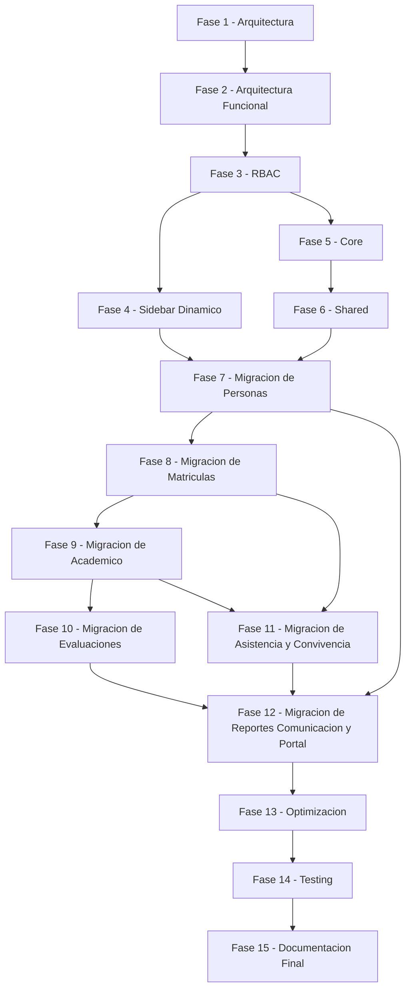
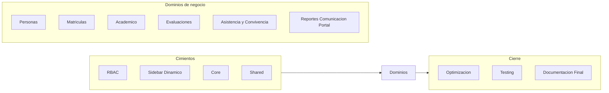

# Plan Maestro de Implementación y Migración

## 0. Propósito de este documento

Este documento cierra la fase de análisis y diseño del proyecto Colegio. Toma como punto de partida dos documentos ya aprobados y definitivos:

- **Manual Oficial de Arquitectura y Estándares de Desarrollo** ([08-estandares.md](08-estandares.md)): define las reglas técnicas obligatorias de organización, capas, convenciones y calidad.
- **Arquitectura Funcional del Negocio** ([02-arquitectura-funcional.md](02-arquitectura-funcional.md)): define los dominios, procesos, actores y reglas del negocio escolar.

Ninguno de los dos documentos se modifica, se reinterpreta ni se contradice aquí. Este Plan Maestro no diseña arquitectura ni negocio: diseña **la ruta** para llevar el proyecto desde su estado actual hasta el estado objetivo que ambos documentos ya definieron.

Este documento no contiene código, no mueve archivos y no implementa nada. A partir de su aprobación, toda conversación de trabajo se orienta exclusivamente a ejecutar las fases aquí descritas, en el orden aquí descrito.

---

## 1. Resumen Ejecutivo

### 1.1 Estado actual del proyecto

El sistema Colegio es un monolito modular pragmático construido sobre Laravel 12. Existen 13 módulos funcionales bajo `app/Modules` (Auth, Usuarios, Matriculas, GestionAcademica, Calificaciones, Asistencia, Observaciones, Reportes, Comunicados, Landing, Dashboard, Perfil, Rector) organizados por dominio de negocio, con rutas, controladores y vistas separados por módulo. Esta base es real y aprovechable: no se trata de un sistema desorganizado, sino de un sistema que creció de forma orgánica sin un manual formal que ahora sí existe.

Sin embargo, el estado actual presenta brechas relevantes frente al Manual Oficial y frente a la Arquitectura Funcional:

- No existe una capa `Core` ni `Shared` desarrolladas; `Core` solo contiene una carpeta de controladores y `Shared` solo contiene el `SidebarBuilder`.
- La autorización se resuelve con un único middleware por rol (`role:admin,rector`); no existen Policies, ni permisos granulares, ni el modelo de 7 actores que exige la Arquitectura Funcional.
- El menú de navegación (`panel_menu.php`) es una estructura estática, no derivada de permisos.
- La mayoría de los módulos no tiene Services, Actions, Repositories, Policies, DTO ni Tests propios; solo `Usuarios` tiene una capa `Services`.
- Las tablas de negocio (estudiantes, matrículas, notas, asistencia, etc.) no tienen migraciones propias: el sistema opera sobre una base de datos heredada del sistema legacy.
- La suite de pruebas es la de scaffold por defecto de Laravel; no existen pruebas reales sobre reglas de negocio.
- Hay controladores con demasiadas responsabilidades (`GestionAcademicaController`, `CalificacionesController`) y lógica duplicada (activar/desactivar, generación de códigos, creación de usuarios).

### 1.2 Estado objetivo

El estado objetivo es el descrito en el Manual Oficial: un monolito modular maduro, organizado por dominio de negocio, con `Core` y `Shared` como capas transversales reales, cada módulo con su estructura completa (Controllers, Services, Actions, Repositories, Models, Policies, Requests, Routes, Views, Providers, Events, Listeners, Tests, Contracts, DTO, Enums, Traits, Support), autorización granular basada en los 7 actores y permisos de negocio definidos en la Arquitectura Funcional, y navegación derivada dinámicamente de esos permisos.

### 1.3 Beneficios esperados

- Autorización auditable y alineada al negocio real (7 actores, no 2 roles).
- Reducción de deuda técnica y de duplicidad de lógica.
- Módulos que pueden evolucionar de forma independiente sin romperse entre sí.
- Base de datos con migraciones propias, versionadas y reproducibles.
- Cobertura de pruebas sobre comportamiento crítico del negocio.
- Documentación viva que refleja la realidad del sistema.
- Capacidad de crecer durante años sin reescrituras totales.

### 1.4 Riesgos

El riesgo principal no es técnico en sí mismo, sino operativo: el sistema está en producción sirviendo la operación real de un colegio. Migrar autorización, navegación y módulos sin afectar el funcionamiento diario exige una estrategia incremental, reversible y verificada en cada paso. El detalle de riesgos se desarrolla en la sección 6.

### 1.5 Estrategia de migración

La estrategia es **incremental, aditiva y verificable por fase**: ningún paso elimina una ruta, tabla o comportamiento existente antes de que su reemplazo esté probado y operando en paralelo. El orden de las fases respeta estrictamente las dependencias funcionales definidas en la Arquitectura Funcional (sección 8 y 10 de ese documento) y las dependencias técnicas definidas en el Manual Oficial (sección 7). El detalle se desarrolla en la sección 9.

---

## 2. Estado de Madurez

Evaluación porcentual del estado actual frente al estado objetivo definido por el Manual Oficial y la Arquitectura Funcional. El porcentaje refleja qué tan cerca está el proyecto de cumplir esa definición, no un juicio de calidad absoluta.

| Aspecto | Madurez | Justificación |
|---|---|---|
| Arquitectura | 55% | Existe separación por módulos de negocio y un flujo MVC consistente, pero `Core` y `Shared` no están desarrollados según el Manual, y no hay una capa de dominio explícita separada de la infraestructura HTTP. |
| Organización | 60% | La convención `app/Modules/{Modulo}` se respeta, pero de forma inconsistente: varios módulos carecen de `Requests`, `Models` o `Services` propios aunque los necesiten. |
| Modularidad | 50% | Los módulos están delimitados por carpeta, pero no por contrato: no hay `Contracts` ni `DTO` que regulen la comunicación entre módulos, por lo que el acoplamiento real es mayor al que aparenta la estructura de carpetas. |
| Escalabilidad | 40% | La dependencia de una base de datos heredada sin migraciones propias y la concentración de lógica en controladores grandes limitan la capacidad de crecer sin fricción. |
| Seguridad | 35% | La autorización se resuelve con un middleware de rol simple (`admin,rector`); no hay Policies ni control de acceso a nivel de recurso, lo cual no cumple con "seguridad por diseño" del Manual ni con las reglas de negocio de la Arquitectura Funcional (regla 5 y 6 de la sección 11). |
| Roles y permisos | 25% | Solo existen 2 roles operativos en el middleware, frente a los 7 actores institucionales definidos formalmente. No existe tabla ni modelo de permisos. |
| Documentación | 75% | Con el Manual Oficial, la Arquitectura Funcional y la auditoría técnica ya existentes, la documentación de alto nivel es sólida; falta documentación a nivel de módulo una vez migrado cada uno. |
| Calidad del código | 45% | Hay duplicidad detectada (activar/desactivar, generación de códigos, creación de usuarios) y controladores con múltiples responsabilidades, lo que contradice SRP y DRY del Manual. |
| Mantenibilidad | 45% | El sistema es comprensible para un equipo pequeño, pero la ausencia de pruebas automatizadas hace que cualquier cambio dependa de verificación manual. |
| Preparación para crecimiento | 40% | La base modular es un punto de partida real y aprovechable, pero requiere RBAC, Core, Shared y migraciones propias antes de poder escalar de forma segura. |

**Madurez global estimada: 47%.** El proyecto tiene una base modular saludable pero le falta la mitad del camino hacia lo que el Manual Oficial y la Arquitectura Funcional definen como objetivo.

---

## 3. Roadmap General

| Fase | Nombre | Estado |
|---|---|---|
| Fase 1 | Arquitectura | Completada |
| Fase 2 | Arquitectura Funcional | Completada |
| Fase 3 | RBAC | Pendiente |
| Fase 4 | Sidebar Dinámico | Pendiente |
| Fase 5 | Core | Pendiente |
| Fase 6 | Shared | Pendiente |
| Fase 7 | Migración de Personas | Pendiente |
| Fase 8 | Migración de Matrículas | Pendiente |
| Fase 9 | Migración de Académico | Pendiente |
| Fase 10 | Migración de Evaluaciones | Pendiente |
| Fase 11 | Migración de Asistencia y Convivencia | Pendiente |
| Fase 12 | Migración de Reportes, Comunicación y Portal | Pendiente |
| Fase 13 | Optimización | Pendiente |
| Fase 14 | Testing | Pendiente |
| Fase 15 | Documentación Final | Pendiente |

Nota sobre el agrupamiento de dominios: la Arquitectura Funcional define 11 dominios de negocio. Los dominios de **Convivencia** se agrupan con **Asistencia** en la Fase 11 porque ambos son de tamaño reducido, comparten actores (docente, coordinador, acudiente) y alimentan al mismo consumidor (Reportes). Los dominios de **Comunicación** y **Portal público** se agrupan con **Reportes** en la Fase 12 porque son los módulos de menor complejidad técnica relativa, son consumidores finales de información generada por las fases anteriores y no son prerrequisito de ningún otro dominio. Este agrupamiento es una decisión de secuenciación de este Plan Maestro, no una modificación a los dominios definidos en la Arquitectura Funcional.

---

## 4. Orden Oficial de Implementación

El orden no es arbitrario: se deriva directamente de las dependencias funcionales declaradas en la Arquitectura Funcional (sección 8 y 10) y de las dependencias técnicas permitidas en el Manual Oficial (sección 7).

1. **RBAC (Fase 3)** se implementa primero porque "Identidad y acceso" es prerrequisito de todos los demás dominios (Arquitectura Funcional, sección 8) y porque el Manual exige "seguridad por diseño" (sección 3.1) como principio, no como añadido posterior. Migrar módulos de negocio sobre una autorización insuficiente obligaría a retrabajar cada módulo después.

2. **Sidebar Dinámico (Fase 4)** depende directamente de RBAC: la navegación debe derivarse de los permisos reales de cada actor, no de una configuración estática. Hacerlo antes de RBAC sería reconstruir el menú dos veces.

3. **Core (Fase 5)** y **Shared (Fase 6)** se construyen antes de tocar módulos de negocio porque el Manual establece que todo módulo puede depender de Core y Shared (sección 7.1), pero no al revés. Si los módulos se migran antes de que estas capas existan, el trabajo de migración tendría que repetirse cuando Core y Shared queden definidos.

4. **Migración de Personas (Fase 7)** es el primer dominio de negocio porque "Personas es prerrequisito de Admisiones y matrícula" (Arquitectura Funcional, sección 8): no puede matricularse alguien que no está registrado como persona.

5. **Migración de Matrículas (Fase 8)** sigue porque "Admisiones y matrícula es prerrequisito de Evaluación, Asistencia y Convivencia" (misma sección): estos procesos solo aplican a un estudiante con matrícula vigente.

6. **Migración de Académico (Fase 9)** — Estructura académica y Gestión pedagógica — se ubica antes de Evaluación porque "Estructura académica es prerrequisito de Gestión pedagógica" y "Gestión pedagógica es prerrequisito de Evaluación y de Asistencia": no puede asignarse un docente a un curso o asignatura que no existe.

7. **Migración de Evaluaciones (Fase 10)** requiere que ya exista la asignación docente-asignatura-curso vigente (dependencia funcional 3 y 4 de la Arquitectura Funcional, sección 10).

8. **Migración de Asistencia y Convivencia (Fase 11)** puede avanzar en paralelo conceptual con Evaluación porque ambas dependen de la misma base (matrícula vigente + estructura académica), pero se secuencia después para no dividir el equipo entre dos migraciones de negocio críticas al mismo tiempo.

9. **Migración de Reportes, Comunicación y Portal (Fase 12)** se hace al final de las migraciones de dominio porque "los reportes institucionales dependen de la información generada por matrícula, evaluación, asistencia y convivencia; no son una fuente primaria de datos, sino una consolidación derivada" (Arquitectura Funcional, sección 10, regla 7). Comunicación depende de Personas, ya migrado en Fase 7. Portal público es funcionalmente independiente del resto (Arquitectura Funcional, sección 8) por lo que no bloquea ni es bloqueado por las fases anteriores, y se aprovecha el cierre de ciclo para migrarlo junto con Reportes.

10. **Optimización (Fase 13)** se hace después de tener todos los dominios migrados porque optimizar prematuramente sobre una estructura que todavía va a cambiar es trabajo desechable.

11. **Testing (Fase 14)** se consolida como fase propia al final para cubrir pruebas de integración de punta a punta entre módulos ya migrados, además de las pruebas mínimas que cada módulo ya debe traer desde su propia migración (ver sección 8, Definition of Done).

12. **Documentación Final (Fase 15)** cierra el proyecto reflejando el estado real del sistema ya migrado, no un estado planeado.

---

## 5. Dependencias entre fases

---

## 6. Riesgos Técnicos

### 6.1 Riesgos altos

| Riesgo | Impacto | Mitigación |
|---|---|---|
| El sistema opera sobre una base de datos legacy sin migraciones propias para las tablas de negocio. | Cualquier migración de módulo puede romper datos en producción sin posibilidad de reproducir el esquema en un entorno limpio. | Crear migraciones baseline no destructivas que documenten el esquema real antes de migrar cada módulo (parte del Definition of Done de cada fase de dominio, sección 8). |
| Cambiar la autorización (RBAC) puede dejar sin acceso a usuarios activos del colegio en plena operación. | Interrupción del servicio a docentes, secretaría, rector, etc. | Implementar RBAC en paralelo al middleware de rol actual, validar equivalencia de accesos actor por actor antes de retirar el middleware antiguo (ver estrategia de migración, sección 9). |
| Ausencia total de pruebas automatizadas sobre reglas de negocio. | Ninguna migración puede verificarse de forma confiable; las regresiones solo se detectarían en producción. | Exigir pruebas mínimas como parte del Definition of Done de cada módulo migrado (sección 8), antes de continuar con la siguiente fase. |

### 6.2 Riesgos medios

| Riesgo | Impacto | Mitigación |
|---|---|---|
| El menú (`panel_menu.php`) es consumido por vistas y rutas con nombres concretos; cambiarlo a dinámico puede romper enlaces existentes. | Navegación rota para actores en producción durante la Fase 4. | Mantener los nombres de ruta existentes durante la transición; el sidebar dinámico debe leer los mismos permisos que gobiernan las rutas, no renombrar rutas. |
| Controladores con múltiples responsabilidades (`GestionAcademicaController`, `CalificacionesController`) dificultan una migración limpia por partes. | Riesgo de migraciones parciales que dejen lógica duplicada temporalmente. | Migrar por caso de uso completo (una acción de negocio a la vez), no por archivo completo, y retirar la lógica antigua solo cuando la nueva esté verificada. |
| La generación de boletines está acoplada al controlador y es sensible a rendimiento. | Degradación de tiempos de respuesta al migrar el módulo de Evaluaciones (Fase 10). | Extraer la generación de boletines a un Service/Action medible de forma aislada antes de optimizar, y solo optimizar con datos de rendimiento reales (Fase 13). |
| Migrar varios módulos con equipo reducido puede generar trabajo en curso simultáneo que rompa las dependencias del orden oficial (sección 4). | Fases ejecutadas fuera de orden generan retrabajo. | No iniciar una fase de dominio hasta que la fase de la que depende cumpla su criterio de finalización (sección 7). |

### 6.3 Riesgos bajos

| Riesgo | Impacto | Mitigación |
|---|---|---|
| Deriva de convenciones de nombres entre módulos ya migrados y módulos aún no migrados. | Inconsistencia visual en el código durante la transición, sin afectar funcionamiento. | Checklist de Pull Request del Manual Oficial (sección 11) aplicado desde la primera fase de migración. |
| Documentación desactualizada respecto al avance real. | Confusión sobre el estado real del proyecto. | Actualizar el checklist general (sección 11 de este documento) al cierre de cada fase, no al final del proyecto. |
| Duplicidad temporal de lógica mientras convive el código antiguo y el nuevo dentro del mismo módulo. | Ruido en el código durante la transición. | Limitar la convivencia de código antiguo y nuevo al tiempo mínimo necesario para verificar equivalencia, definido en la estrategia de migración (sección 9). |

---

## 7. Criterios de Finalización

Una fase solo puede considerarse terminada cuando se cumplen **todos** los puntos del siguiente checklist obligatorio:

- [ ] El resultado de la fase fue verificado contra el Manual Oficial de Arquitectura (no contradice ninguna regla de las secciones 3 a 9 de ese documento).
- [ ] El resultado de la fase fue verificado contra la Arquitectura Funcional del Negocio (respeta los dominios, actores y reglas de negocio declarados).
- [ ] La funcionalidad existente antes de la fase sigue operando sin regresiones observables.
- [ ] Existen pruebas automatizadas para el comportamiento crítico introducido o migrado en la fase.
- [ ] No queda lógica duplicada entre el código antiguo y el nuevo una vez cerrada la fase.
- [ ] La documentación de arquitectura (`docs/arquitectura`) refleja el estado real alcanzado por la fase.
- [ ] El checklist de Pull Request del Manual Oficial (sección 11 de ese documento) fue aplicado a cada cambio de la fase.
- [ ] La fase fue validada manualmente sobre los actores reales que la usan (por ejemplo: si la fase toca Matrículas, se valida con un flujo real de secretaría).
- [ ] Existe un punto de retroceso identificado (commit, tag o rama) por si la fase debe revertirse.
- [ ] No se inicia la siguiente fase hasta que todos los puntos anteriores estén marcados.

---

## 8. Definition of Done (DoD)

Condiciones que debe cumplir **cada módulo migrado** para considerarse finalizado, en línea con el Manual Oficial:

- Arquitectura del módulo aprobada: sigue la estructura oficial de la sección 5.1 del Manual (Controllers, Services, Actions, Repositories, Models, Http/Requests, Policies, Resources, Routes, Views, Providers, y las demás carpetas que apliquen según su complejidad real).
- El módulo solo depende de su propio dominio, de Core, de Shared o de contratos explícitos de otros módulos — nunca de modelos, vistas o lógica interna de otro módulo (Manual, sección 7).
- Documentación actualizada: el módulo queda descrito en `docs/arquitectura` con su alcance, dependencias y reglas de autorización.
- Permisos y Policies implementados: el módulo define explícitamente qué actores acceden, con qué permisos y sobre qué recursos, conforme al modelo RBAC de la Fase 3.
- Pruebas superadas: cubren el caso de uso principal, las reglas de autorización, el comportamiento crítico y al menos un caso de fallo esperado (Manual, sección 10.6).
- Sin duplicidad de código: la lógica repetida detectada en la auditoría técnica (activar/desactivar, generación de códigos, creación de usuarios) queda centralizada, no reescrita en paralelo.
- Cumple los principios SOLID, DRY, KISS y YAGNI declarados en el Manual (sección 3).
- Cumple las convenciones oficiales de nombres de clases, controladores, requests, policies, repositories, services, actions, rutas y permisos (Manual, sección 6).
- El módulo antiguo (si existía) fue retirado únicamente después de verificar equivalencia funcional completa con el módulo nuevo.
- El módulo fue revisado con el checklist de Pull Request del Manual Oficial (sección 11) antes de fusionarse.

---

## 9. Estrategia de Migración

La migración de cada módulo sigue el mismo patrón incremental, sin importar el dominio, para minimizar el riesgo de afectar el funcionamiento del sistema en producción:

1. **Congelar el contrato externo.** Antes de tocar un módulo, se documentan sus rutas, nombres de ruta, permisos actuales y vistas consumidas. Ese contrato no cambia durante la migración salvo que la fase lo exija explícitamente (como en RBAC o Sidebar Dinámico).

2. **Construir en paralelo, no sobre lo existente.** La nueva estructura del módulo (Services, Actions, Repositories, Policies, etc.) se construye junto a la implementación actual, sin eliminarla todavía. El módulo antiguo sigue respondiendo tráfico real mientras el nuevo se valida.

3. **Migrar por caso de uso, no por archivo.** Cada caso de uso de negocio (por ejemplo, "matricular estudiante") se migra completo de punta a punta — controlador, validación, lógica, persistencia — antes de pasar al siguiente caso de uso. Esto evita dejar un módulo a medio migrar de forma transversal.

4. **Verificar equivalencia antes de sustituir.** El nuevo caso de uso debe producir el mismo resultado observable que el antiguo, validado con pruebas automatizadas y con verificación manual sobre el actor real correspondiente (Manual, sección 10.6).

5. **Cambiar el enrutamiento solo cuando el nuevo caso de uso está verificado.** El tráfico se redirige del controlador antiguo al nuevo únicamente después de la verificación del paso 4, sin cambiar nombres de ruta visibles para no romper vistas ni enlaces existentes.

6. **Retirar el código antiguo al final, no antes.** El código y las clases antiguas del caso de uso migrado se eliminan solo cuando el nuevo lleva operando sin incidentes el tiempo definido por el equipo para esa fase. No se elimina "por adelantado" en previsión de que funcione.

7. **Migraciones de base de datos aditivas.** Cuando un módulo requiera una migración baseline (tablas heredadas sin migración propia), la migración se crea en modo no destructivo: documenta el esquema existente sin alterar datos. Cualquier cambio de esquema posterior se hace con migraciones reversibles y con respaldo previo.

8. **Punto de retroceso en cada paso.** Cada caso de uso migrado se entrega en un commit o rama identificable que permite revertir sin afectar el resto del módulo, en línea con el criterio de finalización de la sección 7.

Este patrón es el mismo tanto para RBAC y Sidebar Dinámico como para cada dominio de negocio migrado en las fases 7 a 12; lo único que cambia es el contenido del caso de uso, no el método.

---

## 10. Cronograma Recomendado

El cronograma asume un equipo reducido (1 a 3 desarrolladores), consistente con el ritmo de trabajo observado en el historial del proyecto. Las duraciones son estimaciones de esfuerzo, no fechas comprometidas.

### Sprint 1 — RBAC
- **Objetivo:** implementar el modelo de roles y permisos granular de los 7 actores definidos en la Arquitectura Funcional, en paralelo al middleware de rol actual.
- **Duración estimada:** 3 semanas.
- **Entregables:** modelo de permisos, Policies base, mapeo actor-permiso documentado, convivencia verificada con el middleware `role` actual.
- **Dependencias:** Fase 2 (Arquitectura Funcional) completada.
- **Resultado esperado:** cualquier actor puede autenticarse y su acceso puede validarse por permiso, no solo por rol amplio, sin que ningún actor pierda acceso a lo que ya tenía.

### Sprint 2 — Sidebar Dinámico
- **Objetivo:** que la navegación del panel se derive de los permisos definidos en RBAC, no de una configuración estática.
- **Duración estimada:** 2 semanas.
- **Entregables:** `SidebarBuilder` reescrito para leer permisos, `panel_menu.php` migrado a una fuente derivada o validada contra permisos.
- **Dependencias:** Sprint 1.
- **Resultado esperado:** cada actor ve únicamente las opciones de menú correspondientes a sus permisos reales.

### Sprint 3 — Core
- **Objetivo:** construir la capa Core definida en el Manual Oficial (middleware base, excepciones del sistema, contratos de infraestructura, clases base).
- **Duración estimada:** 2 semanas.
- **Entregables:** estructura `app/Core` poblada según la sección 4.2 del Manual.
- **Dependencias:** Sprint 1 (RBAC aporta el middleware de autorización que Core debe albergar).
- **Resultado esperado:** ningún módulo de negocio necesita reimplementar infraestructura transversal.

### Sprint 4 — Shared
- **Objetivo:** construir la capa Shared (DTOs, value objects, enums, traits, componentes de interfaz reutilizables).
- **Duración estimada:** 2 semanas.
- **Entregables:** estructura `app/Shared` poblada según la sección 4.3 del Manual; migración de `SidebarBuilder` y otros componentes reutilizables actuales a esta capa.
- **Dependencias:** Sprint 3.
- **Resultado esperado:** los módulos de negocio tienen dónde ubicar lo reutilizable sin duplicarlo.

### Sprint 5 y 6 — Migración de Personas
- **Objetivo:** migrar Identidad y acceso, y Personas (Auth + Usuarios) a la estructura oficial de módulo, con Policies y pruebas propias.
- **Duración estimada:** 3 semanas.
- **Entregables:** módulos `Identidad` y `Personas` (o equivalentes) migrados según el DoD de la sección 8.
- **Dependencias:** Sprints 1 a 4.
- **Resultado esperado:** el registro, edición y consulta de estudiantes, docentes, administrativos y acudientes opera sobre la nueva estructura sin regresiones.

### Sprint 7 — Migración de Matrículas
- **Objetivo:** migrar el dominio de Admisiones y matrícula.
- **Duración estimada:** 2 semanas.
- **Entregables:** módulo `Matriculas` migrado según el DoD.
- **Dependencias:** Sprint 5-6.
- **Resultado esperado:** el flujo completo de matrícula (solicitud, verificación de cupo, formalización, renovación) opera sobre la nueva estructura.

### Sprint 8 y 9 — Migración de Académico
- **Objetivo:** migrar Estructura académica y Gestión pedagógica, descomponiendo `GestionAcademicaController` en responsabilidades separadas.
- **Duración estimada:** 3 semanas.
- **Entregables:** módulo(s) de estructura académica y asignación docente-asignatura-curso migrados.
- **Dependencias:** Sprint 7.
- **Resultado esperado:** la organización de niveles, cursos, asignaturas y asignaciones docentes opera sobre la nueva estructura, sin el controlador sobrecargado original.

### Sprint 10 — Migración de Evaluaciones
- **Objetivo:** migrar Evaluación y calificaciones, extrayendo la generación de boletines a un Service/Action medible.
- **Duración estimada:** 3 semanas.
- **Entregables:** módulo `Calificaciones`/`Reportes académicos` migrado, generación de boletines desacoplada del controlador.
- **Dependencias:** Sprint 8-9.
- **Resultado esperado:** periodos, actividades, notas y boletines operan sobre la nueva estructura con tiempos de respuesta medidos.

### Sprint 11 — Migración de Asistencia y Convivencia
- **Objetivo:** migrar Asistencia y Convivencia/Observaciones.
- **Duración estimada:** 2 semanas.
- **Entregables:** módulos `Asistencia` y `Observaciones` migrados según el DoD.
- **Dependencias:** Sprint 8-9 (requiere estructura académica y asignación docente vigente).
- **Resultado esperado:** registro de asistencia y de observaciones opera sobre la nueva estructura, con alertas de riesgo verificadas.

### Sprint 12 — Migración de Reportes, Comunicación y Portal
- **Objetivo:** migrar Reportes e inteligencia institucional, Comunicación institucional y Portal público.
- **Duración estimada:** 3 semanas.
- **Entregables:** módulos `Reportes`, `Comunicados` y `Landing` migrados según el DoD.
- **Dependencias:** Sprint 10 y 11 (Reportes consolida datos de evaluación y asistencia), Sprint 5-6 (Comunicación depende de Personas).
- **Resultado esperado:** reportes institucionales, comunicados y portal público operan sobre la nueva estructura y consolidan datos ya migrados.

### Sprint 13 — Optimización
- **Objetivo:** optimizar con datos reales de uso los puntos identificados como sensibles (generación de boletines, consultas repetidas, tiempos de carga).
- **Duración estimada:** 2 semanas.
- **Entregables:** mejoras de rendimiento medidas antes/después.
- **Dependencias:** todas las migraciones de dominio completadas (Sprint 12).
- **Resultado esperado:** el sistema migrado iguala o mejora los tiempos de respuesta del sistema original.

### Sprint 14 — Testing
- **Objetivo:** consolidar pruebas de integración de punta a punta entre módulos ya migrados, más allá de las pruebas mínimas de cada módulo.
- **Duración estimada:** 2 semanas.
- **Entregables:** suite de pruebas de integración cubriendo los procesos completos de la sección 4 de la Arquitectura Funcional.
- **Dependencias:** Sprint 13.
- **Resultado esperado:** los procesos de punta a punta (matrícula, evaluación, asistencia, convivencia, comunicación, reportes) están cubiertos por pruebas automatizadas.

### Sprint 15 — Documentación Final
- **Objetivo:** actualizar toda la documentación de arquitectura para reflejar el estado real del sistema migrado.
- **Duración estimada:** 1 semana.
- **Entregables:** `docs/arquitectura` actualizado, checklist general (sección 11) cerrado al 100%.
- **Dependencias:** Sprint 14.
- **Resultado esperado:** cualquier persona nueva en el proyecto puede entender el sistema real leyendo únicamente `docs/arquitectura`.

**Duración total estimada: aproximadamente 33 semanas (8 meses) de esfuerzo continuo**, sin contar interrupciones por soporte del sistema en producción durante la migración.

---

## 11. Checklist General del Proyecto

- [ ] Fase 1 — Arquitectura (Manual Oficial aprobado)
- [ ] Fase 2 — Arquitectura Funcional (aprobada)
- [ ] Fase 3 — RBAC implementado y verificado contra los 7 actores
- [ ] Fase 4 — Sidebar dinámico implementado y verificado por actor
- [ ] Fase 5 — Core construido según el Manual
- [ ] Fase 6 — Shared construido según el Manual
- [ ] Fase 7 — Personas migrado (DoD cumplido)
- [ ] Fase 8 — Matrículas migrado (DoD cumplido)
- [ ] Fase 9 — Académico migrado (DoD cumplido)
- [ ] Fase 10 — Evaluaciones migrado (DoD cumplido)
- [ ] Fase 11 — Asistencia y Convivencia migrado (DoD cumplido)
- [ ] Fase 12 — Reportes, Comunicación y Portal migrado (DoD cumplido)
- [ ] Fase 13 — Optimización completada con métricas antes/después
- [ ] Fase 14 — Testing de integración completo sobre los procesos de negocio
- [ ] Fase 15 — Documentación final actualizada al 100%
- [ ] Ninguna fase se marcó completa sin cumplir su checklist de finalización (sección 7)
- [ ] Ningún módulo se marcó migrado sin cumplir su Definition of Done (sección 8)
- [ ] No quedan controladores con las responsabilidades múltiples detectadas en la auditoría original
- [ ] No queda lógica duplicada de las detectadas en la auditoría original (activar/desactivar, generación de códigos, creación de usuarios)
- [ ] Todas las tablas de negocio cuentan con migración propia documentada

---

## 12. Conclusiones

Esta metodología reduce el riesgo del proyecto porque nunca depende de un salto único: cada fase tiene un criterio de finalización verificable (sección 7), cada módulo tiene una definición de terminado auditable (sección 8), y cada migración se ejecuta en paralelo a lo existente antes de reemplazarlo (sección 9). Esto significa que, en cualquier punto del proceso, el sistema en producción sigue funcionando, y cualquier fase puede revertirse sin arrastrar a las demás.

El orden de las fases no es una preferencia técnica: es la consecuencia directa de las dependencias de negocio que la Arquitectura Funcional ya declaró como obligatorias (sección 10 de ese documento) y de las reglas de dependencia que el Manual Oficial ya declaró como vinculantes (sección 7 de ese documento). Seguir este orden es, en la práctica, seguir los dos documentos aprobados sin desviarse de ellos.

Por último, esta forma de migrar — incremental, verificable y documentada en cada paso — es lo que permite que el sistema crezca durante muchos años sin volver a necesitar una reescritura total. Un colegio no detiene su operación para que un sistema se modernice; este plan está diseñado para que la modernización ocurra mientras el colegio sigue funcionando.
